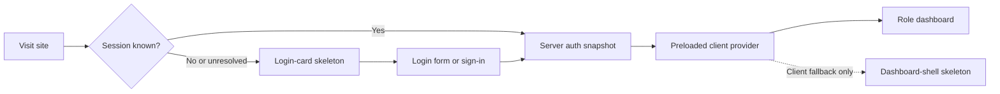
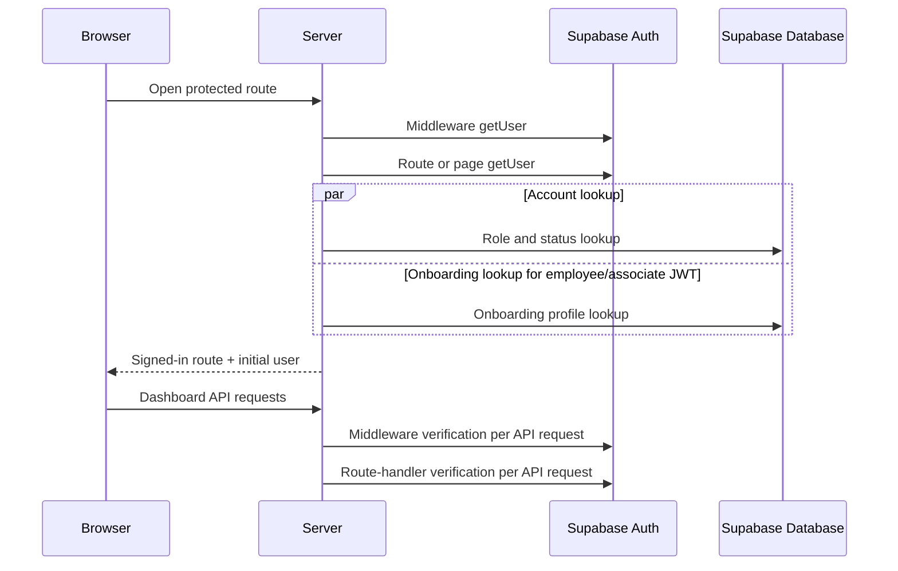
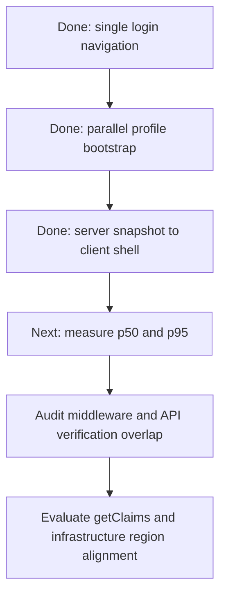

# Authentication Optimization Record

This is the durable record of authentication-related optimizations. Add an entry whenever work is audited, planned, implemented, changed, or validated so future work can distinguish measured improvements from ideas that are still pending.

## Visual Documentation Rule

Use a compact Mermaid diagram when an optimization crosses three or more stages, spans multiple application layers, or has a security/performance tradeoff. Keep simple single-file changes as concise text. Update the relevant diagram whenever its described flow changes.

## Status Legend

- **Implemented**: shipped in the working tree and validated.
- **Planned**: reviewed and approved for a future implementation.
- **Audited**: investigated with evidence, but not yet approved or implemented.
- **Deferred**: intentionally postponed, with a condition for resuming work.

## Visual Guide

### User experience during authentication

Normal signed-in requests now receive a preloaded user and can render the real shell immediately. The two skeletons remain useful for local mock auth and client recovery paths.

### Current latency hotspots

Serial browser profile hydration has been removed from normal signed-in routes. Repeated Auth validation in middleware, the app layout, and protected APIs is the remaining application-level hotspot; region distance may amplify every remote call.

### Planned optimization direction

Each stage requires its stated validation before the next optimization is treated as complete.

## Relevant Code Map

Use this map to jump from an optimization entry to the implementation area it affects.

| Concern | Primary files | Why these files matter |
| --- | --- | --- |
| Server-side login redirect | [`apps/web/src/app/(auth)/login/page.tsx`](../../../apps/web/src/app/(auth)/login/page.tsx) | Verifies an existing session, resolves role/status, and redirects authenticated visitors before the login form renders. |
| Client login behavior and login skeleton | [`apps/web/src/app/(auth)/login/LoginForm.tsx`](../../../apps/web/src/app/(auth)/login/LoginForm.tsx) | Handles password submission, client fallback redirects, and the login-card skeleton. |
| Client auth provider and login transition | [`apps/web/src/contexts/AuthContext.tsx`](../../../apps/web/src/contexts/AuthContext.tsx) | Accepts the server-preloaded user, retains browser fallback recovery, and performs the streamlined post-login cache/navigation transition. |
| Signed-in server bootstrap | [`apps/web/src/app/(app)/layout.tsx`](../../../apps/web/src/app/(app)/layout.tsx) | Authenticates the request, resolves the minimal user snapshot, and initializes AuthProvider before the signed-in shell renders. |
| Shared user bootstrap resolver | [`apps/web/src/lib/auth/user-bootstrap.ts`](../../../apps/web/src/lib/auth/user-bootstrap.ts) | Keeps server and browser user resolution consistent and starts eligible account/onboarding reads concurrently. |
| Auth provider boundaries | [`apps/web/src/app/layout.tsx`](../../../apps/web/src/app/layout.tsx), [`apps/web/src/app/(auth)/layout.tsx`](../../../apps/web/src/app/(auth)/layout.tsx), [`apps/web/src/app/onboarding/awaiting-approval/layout.tsx`](../../../apps/web/src/app/onboarding/awaiting-approval/layout.tsx) | Limits client auth bootstrap to route groups that need it and preserves coverage for the standalone approval route. |
| Request middleware verification | [`apps/web/middleware.ts`](../../../apps/web/middleware.ts) | Refreshes/verifies request sessions and currently runs `getUser()` for matched protected requests. |
| Server Supabase client | [`apps/web/src/lib/supabase/server.ts`](../../../apps/web/src/lib/supabase/server.ts) | Builds the cookie-backed server client used by pages and route handlers. |
| Browser Supabase client | [`apps/web/src/lib/supabase/client.ts`](../../../apps/web/src/lib/supabase/client.ts) | Builds the browser client used by AuthContext session hydration. |
| Signed-in shell and dashboard loading state | [`apps/web/src/components/layout/AppShell.tsx`](../../../apps/web/src/components/layout/AppShell.tsx) | Waits for the authenticated user before rendering signed-in navigation and dashboard content. |
| Dashboard-shell skeleton | [`apps/web/src/components/layout/AppShellSkeleton.tsx`](../../../apps/web/src/components/layout/AppShellSkeleton.tsx) | Shows the responsive signed-in placeholder while authentication/profile state is unresolved. |
| Query client behavior | [`apps/web/src/lib/query-client.ts`](../../../apps/web/src/lib/query-client.ts) | Defines React Query defaults relevant to the broad post-login invalidation decision. |
| Employee dashboard requests | [`apps/web/src/app/(app)/(employee)/dashboard/page.tsx`](../../../apps/web/src/app/(app)/(employee)/dashboard/page.tsx) | Starts several dashboard data queries after the signed-in shell is ready. |
| Admin dashboard requests | [`apps/web/src/app/(app)/(admin)/admin/dashboard/page.tsx`](../../../apps/web/src/app/(app)/(admin)/admin/dashboard/page.tsx) | Starts admin dashboard data queries whose API authentication can overlap with middleware verification. |
| Super-admin dashboard requests | [`apps/web/src/app/(app)/(admin)/super-admin/dashboard/page.tsx`](../../../apps/web/src/app/(app)/(admin)/super-admin/dashboard/page.tsx) | Starts super-admin dashboard data queries with the same middleware/API verification consideration. |

### Tests and Validation Files

| Area | Files |
| --- | --- |
| Server redirect behavior | [`tests/app/login-page.test.tsx`](../../../tests/app/login-page.test.tsx), [`tests/app/page.test.ts`](../../../tests/app/page.test.ts) |
| Login skeleton behavior | [`tests/app/login-form.test.tsx`](../../../tests/app/login-form.test.tsx) |
| Dashboard-shell skeleton behavior | [`tests/components/AppShellSkeleton.test.tsx`](../../../tests/components/AppShellSkeleton.test.tsx) |
| Redirect safety rules | [`tests/lib/auth/redirect-config.test.ts`](../../../tests/lib/auth/redirect-config.test.ts) |
| Server-preloaded provider and login navigation | [`tests/contexts/AuthContext.test.tsx`](../../../tests/contexts/AuthContext.test.tsx) |
| Parallel user bootstrap | [`tests/lib/auth/user-bootstrap.test.ts`](../../../tests/lib/auth/user-bootstrap.test.ts) |

## Implemented Optimizations

### Server-side redirect for authenticated `/login` visits

- **Status:** Implemented — 2026-10-01
- **Problem:** An existing session first saw the login form, then the browser restored authentication and redirected to the dashboard.
- **Solution:** Resolve the Supabase user and account routing state on the server before rendering the login form. Retain a guarded browser fallback for local mock auth and transient server-auth failures.
- **Changed paths:**
  - `apps/web/src/app/(auth)/login/page.tsx`
  - `apps/web/src/app/(auth)/login/LoginForm.tsx`
  - `tests/app/login-page.test.tsx`
  - `tests/app/page.test.ts`
- **Validation:** 43 focused tests passed; web TypeScript check passed.

### Login-card skeleton during unresolved client authentication

- **Status:** Implemented — 2026-10-02
- **Problem:** Local mock auth and transient server-auth recovery used a primitive visible `Loading...` message.
- **Solution:** Replace it with an accessible shimmer skeleton that preserves the login card's dimensions and structure.
- **Changed paths:**
  - `apps/web/src/app/(auth)/login/LoginForm.tsx`
  - `tests/app/login-form.test.tsx`
- **Validation:** Focused component tests, targeted Biome checks, and web TypeScript check passed.

### Dashboard-shell skeleton after successful authentication

- **Status:** Implemented — 2026-10-02
- **Problem:** After a successful redirect, the signed-in area still showed a primitive `Loading...` state while browser authentication and user profile data resolved.
- **Solution:** Replace the AppShell fallback with a responsive, role-neutral skeleton for the sidebar, header, summary cards, chart area, and activity panel.
- **Changed paths:**
  - `apps/web/src/components/layout/AppShell.tsx`
  - `apps/web/src/components/layout/AppShellSkeleton.tsx`
  - `tests/components/AppShellSkeleton.test.tsx`
- **Validation:** 46 focused authentication/layout tests passed; targeted Biome checks, `git diff --check`, and web TypeScript check passed.

### Server-preloaded signed-in AuthProvider

- **Status:** Implemented — 2026-10-02
- **Problem:** Protected requests were authenticated on the server, but the global client AuthProvider still began with no user and repeated session, account, and onboarding hydration before showing the real shell.
- **Solution:** Move AuthProvider to the route boundaries. The signed-in `(app)` layout now authenticates and resolves a minimal user snapshot on the server, then passes it as `initialUser`; auth routes and the standalone awaiting-approval route retain client bootstrap where it is needed. Local mock auth still restores from `localStorage`.
- **Changed paths:**
  - `apps/web/src/app/(app)/layout.tsx`
  - `apps/web/src/app/(auth)/layout.tsx`
  - `apps/web/src/app/layout.tsx`
  - `apps/web/src/app/onboarding/awaiting-approval/layout.tsx`
  - `apps/web/src/contexts/AuthContext.tsx`
  - `tests/contexts/AuthContext.test.tsx`
- **Validation:** A regression test proves a server-preloaded user is ready immediately without calling browser `getSession()` or `getUser()`; focused authentication tests and web TypeScript check passed.

### Concurrent account and onboarding bootstrap

- **Status:** Implemented — 2026-10-02
- **Problem:** Employee and associate profile hydration waited for the account/status query before starting the onboarding-profile query.
- **Solution:** Extract one shared bootstrap resolver. When the verified JWT contains an employee or associate `db_role`, it starts both reads together; if metadata is absent or stale, it safely falls back to the database-resolved role. Administrator roles avoid the unnecessary onboarding query.
- **Changed paths:**
  - `apps/web/src/lib/auth/user-bootstrap.ts`
  - `apps/web/src/contexts/AuthContext.tsx`
  - `apps/web/src/app/(app)/layout.tsx`
  - `tests/lib/auth/user-bootstrap.test.ts`
- **Validation:** Unit tests prove both onboarding-role reads are started before either resolves and that administrators perform only the account read.

### Single post-login cache and navigation transition

- **Status:** Implemented — 2026-10-02
- **Problem:** Successful password login awaited global React Query invalidation, refreshed the login route, then pushed the dashboard route. The Supabase `SIGNED_IN` callback could also race the explicit profile resolution.
- **Solution:** Clear previous-session query data synchronously, suppress the duplicate `SIGNED_IN` bootstrap while explicit login resolution is active, and perform one `router.replace(destination)`. Destination queries populate the clean cache after navigation.
- **Changed paths:**
  - `apps/web/src/contexts/AuthContext.tsx`
  - `tests/contexts/AuthContext.test.tsx`
- **Validation:** A regression test verifies `queryClient.clear()` is used, global invalidation is not called, and the correct dashboard route is replaced once.

## Audited Optimization Opportunities

### Measure the current baseline first

- **Status:** Audited — 2026-10-02
- **Finding:** There is no phase-by-phase production timing for sign-in, middleware verification, profile bootstrap, navigation, or first useful dashboard content.
- **Planned solution:** Add client performance marks and server timing, then record p50 and p95 for returning users and fresh password logins.
- **Success measure:** Identify whether the principal delay is Auth, database bootstrap, navigation, dashboard APIs, or application/Supabase region distance.

### Reduce repeated Auth verification in middleware and dashboard APIs

- **Status:** Audited
- **Evidence:** Middleware validates most protected requests with `getUser()`, while protected route handlers generally validate again. Dashboard pages may make several API requests concurrently.
- **Planned solution:** Audit every protected API route. After proving each handler validates authorization near its data source, avoid middleware-plus-handler duplicate verification for API requests.
- **Expected effect:** Reduce Auth-server round trips per dashboard panel.
- **Safety checks:** Complete route inventory and authorization regression tests before changing middleware coverage.

### Evaluate `getClaims()` for eligible middleware checks

- **Status:** Deferred
- **Reason:** The project uses `@supabase/ssr` 0.7.0. Adoption requires a package upgrade, confirmation of asymmetric JWT signing, and a documented acceptable window for detecting server-side session revocation.
- **Resume condition:** Production timing baseline and a tested SSR package upgrade plan are available.
- **Notes:** Supabase recommends `getClaims()` for verified page/data protection where local JWT verification is available; `getUser()` remains appropriate when the latest Auth-server user record or immediate revoked-session detection is required.

### Co-locate application compute and Supabase

- **Status:** Audited
- **Finding:** Network distance can dominate any remaining Auth or profile request time.
- **Planned solution:** Compare deployment and Supabase regions against the timing baseline, then move or configure compute near the database/Auth region if needed.
- **Success measure:** Lower server auth and database timing without changing application behavior.

## Security Rules for Every Optimization

- Do not use browser `getSession()` data alone for secure authorization decisions.
- Keep RLS and route-handler/data-access authorization as the security boundary.
- Do not substitute `getClaims()` for `getUser()` until the session-revocation tradeoff is explicitly accepted.
- Preserve correct routing for disabled, pending-onboarding, and awaiting-approval accounts.
- Validate expired and revoked sessions, all roles, and return-to routing for every auth-flow change.

## Review Sources

- [Supabase SSR client guidance](https://supabase.com/docs/guides/auth/server-side/creating-a-client)
- [Supabase advanced SSR guidance](https://supabase.com/docs/guides/auth/server-side/advanced-guide)
- [Next.js authentication guidance](https://nextjs.org/docs/app/guides/authentication)

## Change Log

- 2026-10-01: Recorded server-side authenticated-login redirect implementation.
- 2026-10-02: Recorded login-card and dashboard-shell loading skeleton implementations.
- 2026-10-02: Recorded authentication latency audit and future optimization candidates.
- 2026-10-02: Added preview-friendly Mermaid diagrams and a visual-documentation rule for future optimization entries.
- 2026-10-02: Added a file-by-file code map and validation-file map for optimization review and implementation navigation.
- 2026-10-02: Implemented server-preloaded signed-in auth state, concurrent employee/associate bootstrap reads, and a single post-login cache/navigation transition. Added regression coverage for the shared resolver and AuthProvider behavior; retained server/RLS authorization boundaries and deferred middleware/API verification changes.
