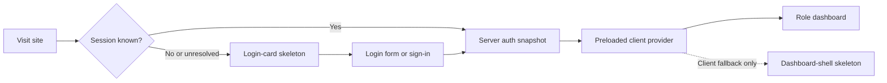
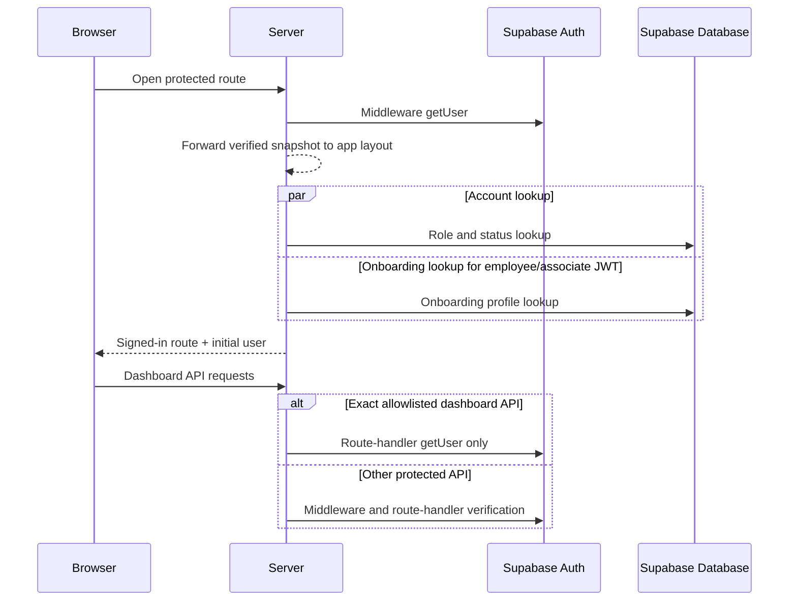
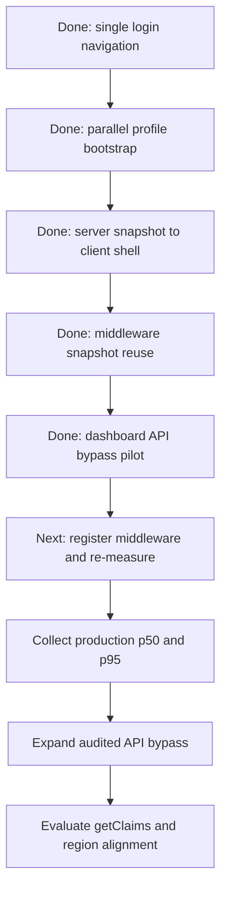

# Authentication Optimization Record

This is the durable record of authentication-related optimizations. Add an entry whenever work is audited, planned, implemented, changed, or validated so future work can distinguish measured improvements from ideas that are still pending.

## Visual Documentation Rule

Use a compact Mermaid diagram when an optimization crosses three or more stages, spans multiple application layers, or has a security/performance tradeoff. Keep simple single-file changes as concise text. Update the relevant diagram whenever its described flow changes.

## Status Legend

- **Implemented**: shipped in the working tree and validated.
- **Planned**: reviewed and approved for a future implementation.
- **Audited**: investigated with evidence, but not yet approved or implemented.
- **Deferred**: intentionally postponed, with a condition for resuming work.

## Visual Guide

### User experience during authentication

Normal signed-in requests now receive a preloaded user and can render the real shell immediately. The two skeletons remain useful for local mock auth and client recovery paths.

### Current latency hotspots

Serial browser profile hydration and middleware/layout double verification have been removed in code. As of 2026-10-07, however, Next.js does not register the middleware (see [Register the Next.js middleware](#register-the-nextjs-middleware)), so the `Middleware getUser` step above does not run. Today the layout fallback performs the only page-level `getUser()`. Four dashboard APIs also avoid middleware/handler duplication. The remaining API inventory is still mixed and must be expanded only with handler-level security coverage; region distance may amplify every remaining remote call.

### Planned optimization direction

Each stage requires its stated validation before the next optimization is treated as complete.

## Relevant Code Map

Use this map to jump from an optimization entry to the implementation area it affects.

| Concern | Primary files | Why these files matter |
| --- | --- | --- |
| Server-side login redirect | [`apps/web/src/app/(auth)/login/page.tsx`](../../../apps/web/src/app/(auth)/login/page.tsx) | Verifies an existing session, resolves role/status, and redirects authenticated visitors before the login form renders. |
| Client login behavior and login skeleton | [`apps/web/src/app/(auth)/login/LoginForm.tsx`](../../../apps/web/src/app/(auth)/login/LoginForm.tsx) | Handles password submission, client fallback redirects, and the login-card skeleton. |
| Client auth provider and login transition | [`apps/web/src/contexts/AuthContext.tsx`](../../../apps/web/src/contexts/AuthContext.tsx) | Accepts the server-preloaded user, retains browser fallback recovery, and performs the streamlined post-login cache/navigation transition. |
| Signed-in server bootstrap | [`apps/web/src/app/(app)/layout.tsx`](../../../apps/web/src/app/(app)/layout.tsx) | Authenticates the request, resolves the minimal user snapshot, and initializes AuthProvider before the signed-in shell renders. |
| Shared user bootstrap resolver | [`apps/web/src/lib/auth/user-bootstrap.ts`](../../../apps/web/src/lib/auth/user-bootstrap.ts) | Keeps server and browser user resolution consistent and starts eligible account/onboarding reads concurrently. |
| Auth provider boundaries | [`apps/web/src/app/layout.tsx`](../../../apps/web/src/app/layout.tsx), [`apps/web/src/app/(auth)/layout.tsx`](../../../apps/web/src/app/(auth)/layout.tsx), [`apps/web/src/app/onboarding/awaiting-approval/layout.tsx`](../../../apps/web/src/app/onboarding/awaiting-approval/layout.tsx) | Limits client auth bootstrap to route groups that need it and preserves coverage for the standalone approval route. |
| Request middleware verification | [`apps/web/middleware.ts`](../../../apps/web/middleware.ts) | Refreshes/verifies protected page sessions, forwards the verified snapshot upstream, and holds the exact dashboard API bypass allowlist. |
| Verified request snapshot | [`apps/web/src/lib/auth/request-snapshot.ts`](../../../apps/web/src/lib/auth/request-snapshot.ts) | Serializes only the identity fields needed by the layout and validates the forwarded snapshot before reuse. |
| Auth timing instrumentation | [`apps/web/src/lib/auth/timing.ts`](../../../apps/web/src/lib/auth/timing.ts), [`apps/web/src/lib/observability/timing.ts`](../../../apps/web/src/lib/observability/timing.ts) | Emits optional structured PII-free timing events and formats `Server-Timing` metrics; the auth wrapper delegates to the shared helper. |
| Latency measurement tooling | [`scripts/performance/measure-latency.ts`](../../../scripts/performance/measure-latency.ts), [`scripts/performance/lib/latency-stats.ts`](../../../scripts/performance/lib/latency-stats.ts), [`tests/scripts/performance/latency-stats.test.ts`](../../../tests/scripts/performance/latency-stats.test.ts) | `pnpm performance:latency --preset auth` sampling, log summaries, and before/after comparison used for the [Measurements](#measurements) section. |
| Server Supabase client | [`apps/web/src/lib/supabase/server.ts`](../../../apps/web/src/lib/supabase/server.ts) | Builds the cookie-backed server client used by pages and route handlers. |
| Browser Supabase client | [`apps/web/src/lib/supabase/client.ts`](../../../apps/web/src/lib/supabase/client.ts) | Builds the browser client used by AuthContext session hydration. |
| Signed-in shell and dashboard loading state | [`apps/web/src/components/layout/AppShell.tsx`](../../../apps/web/src/components/layout/AppShell.tsx) | Waits for the authenticated user before rendering signed-in navigation and dashboard content. |
| Dashboard-shell skeleton | [`apps/web/src/components/layout/AppShellSkeleton.tsx`](../../../apps/web/src/components/layout/AppShellSkeleton.tsx) | Shows the responsive signed-in placeholder while authentication/profile state is unresolved. |
| Query client behavior | [`apps/web/src/lib/query-client.ts`](../../../apps/web/src/lib/query-client.ts) | Defines React Query defaults relevant to the broad post-login invalidation decision. |
| Employee dashboard requests | [`apps/web/src/app/(app)/(employee)/dashboard/page.tsx`](../../../apps/web/src/app/(app)/(employee)/dashboard/page.tsx) | Starts several dashboard data queries after the signed-in shell is ready. |
| Admin dashboard requests | [`apps/web/src/app/(app)/(admin)/admin/dashboard/page.tsx`](../../../apps/web/src/app/(app)/(admin)/admin/dashboard/page.tsx) | Starts admin dashboard data queries whose API authentication can overlap with middleware verification. |
| Super-admin dashboard requests | [`apps/web/src/app/(app)/(admin)/super-admin/dashboard/page.tsx`](../../../apps/web/src/app/(app)/(admin)/super-admin/dashboard/page.tsx) | Starts super-admin dashboard data queries with the same middleware/API verification consideration. |

### Tests and Validation Files

| Area | Files |
| --- | --- |
| Server redirect behavior | [`tests/app/login-page.test.tsx`](../../../tests/app/login-page.test.tsx), [`tests/app/page.test.ts`](../../../tests/app/page.test.ts) |
| Login skeleton behavior | [`tests/app/login-form.test.tsx`](../../../tests/app/login-form.test.tsx) |
| Dashboard-shell skeleton behavior | [`tests/components/AppShellSkeleton.test.tsx`](../../../tests/components/AppShellSkeleton.test.tsx) |
| Redirect safety rules | [`tests/lib/auth/redirect-config.test.ts`](../../../tests/lib/auth/redirect-config.test.ts) |
| Server-preloaded provider and login navigation | [`tests/contexts/AuthContext.test.tsx`](../../../tests/contexts/AuthContext.test.tsx) |
| Parallel user bootstrap | [`tests/lib/auth/user-bootstrap.test.ts`](../../../tests/lib/auth/user-bootstrap.test.ts) |
| Middleware snapshot and API bypass policy | [`tests/middleware-auth.test.ts`](../../../tests/middleware-auth.test.ts), [`tests/lib/auth/request-snapshot.test.ts`](../../../tests/lib/auth/request-snapshot.test.ts) |
| Signed-in layout snapshot reuse | [`tests/app/app-layout-auth.test.tsx`](../../../tests/app/app-layout-auth.test.tsx) |
| Dashboard handler security boundary | [`tests/api/dashboard-auth-boundary.test.ts`](../../../tests/api/dashboard-auth-boundary.test.ts) |
| Auth timing output | [`tests/lib/auth/timing.test.ts`](../../../tests/lib/auth/timing.test.ts) |

## Implemented Optimizations

### Server-side redirect for authenticated `/login` visits

- **Status:** Implemented — 2026-10-01
- **Problem:** An existing session first saw the login form, then the browser restored authentication and redirected to the dashboard.
- **Solution:** Resolve the Supabase user and account routing state on the server before rendering the login form. Retain a guarded browser fallback for local mock auth and transient server-auth failures.
- **Changed paths:**
  - `apps/web/src/app/(auth)/login/page.tsx`
  - `apps/web/src/app/(auth)/login/LoginForm.tsx`
  - `tests/app/login-page.test.tsx`
  - `tests/app/page.test.ts`
- **Validation:** 43 focused tests passed; web TypeScript check passed.

### Login-card skeleton during unresolved client authentication

- **Status:** Implemented — 2026-10-02
- **Problem:** Local mock auth and transient server-auth recovery used a primitive visible `Loading...` message.
- **Solution:** Replace it with an accessible shimmer skeleton that preserves the login card's dimensions and structure.
- **Changed paths:**
  - `apps/web/src/app/(auth)/login/LoginForm.tsx`
  - `tests/app/login-form.test.tsx`
- **Validation:** Focused component tests, targeted Biome checks, and web TypeScript check passed.

### Dashboard-shell skeleton after successful authentication

- **Status:** Implemented — 2026-10-02
- **Problem:** After a successful redirect, the signed-in area still showed a primitive `Loading...` state while browser authentication and user profile data resolved.
- **Solution:** Replace the AppShell fallback with a responsive, role-neutral skeleton for the sidebar, header, summary cards, chart area, and activity panel.
- **Changed paths:**
  - `apps/web/src/components/layout/AppShell.tsx`
  - `apps/web/src/components/layout/AppShellSkeleton.tsx`
  - `tests/components/AppShellSkeleton.test.tsx`
- **Validation:** 46 focused authentication/layout tests passed; targeted Biome checks, `git diff --check`, and web TypeScript check passed.

### Server-preloaded signed-in AuthProvider

- **Status:** Implemented — 2026-10-02
- **Problem:** Protected requests were authenticated on the server, but the global client AuthProvider still began with no user and repeated session, account, and onboarding hydration before showing the real shell.
- **Solution:** Move AuthProvider to the route boundaries. The signed-in `(app)` layout now authenticates and resolves a minimal user snapshot on the server, then passes it as `initialUser`; auth routes and the standalone awaiting-approval route retain client bootstrap where it is needed. Local mock auth still restores from `localStorage`.
- **Changed paths:**
  - `apps/web/src/app/(app)/layout.tsx`
  - `apps/web/src/app/(auth)/layout.tsx`
  - `apps/web/src/app/layout.tsx`
  - `apps/web/src/app/onboarding/awaiting-approval/layout.tsx`
  - `apps/web/src/contexts/AuthContext.tsx`
  - `tests/contexts/AuthContext.test.tsx`
- **Validation:** A regression test proves a server-preloaded user is ready immediately without calling browser `getSession()` or `getUser()`; focused authentication tests and web TypeScript check passed.

### Concurrent account and onboarding bootstrap

- **Status:** Implemented — 2026-10-02
- **Problem:** Employee and associate profile hydration waited for the account/status query before starting the onboarding-profile query.
- **Solution:** Extract one shared bootstrap resolver. When the verified JWT contains an employee or associate `db_role`, it starts both reads together; if metadata is absent or stale, it safely falls back to the database-resolved role. Administrator roles avoid the unnecessary onboarding query.
- **Changed paths:**
  - `apps/web/src/lib/auth/user-bootstrap.ts`
  - `apps/web/src/contexts/AuthContext.tsx`
  - `apps/web/src/app/(app)/layout.tsx`
  - `tests/lib/auth/user-bootstrap.test.ts`
- **Validation:** Unit tests prove both onboarding-role reads are started before either resolves and that administrators perform only the account read.

### Single post-login cache and navigation transition

- **Status:** Implemented — 2026-10-02
- **Problem:** Successful password login awaited global React Query invalidation, refreshed the login route, then pushed the dashboard route. The Supabase `SIGNED_IN` callback could also race the explicit profile resolution.
- **Solution:** Clear previous-session query data synchronously, suppress the duplicate `SIGNED_IN` bootstrap while explicit login resolution is active, and perform one `router.replace(destination)`. Destination queries populate the clean cache after navigation.
- **Changed paths:**
  - `apps/web/src/contexts/AuthContext.tsx`
  - `tests/contexts/AuthContext.test.tsx`
- **Validation:** A regression test verifies `queryClient.clear()` is used, global invalidation is not called, and the correct dashboard route is replaced once.

### Reuse middleware verification in the signed-in layout

- **Status:** Implemented — 2026-10-02
- **Problem:** Middleware called `getUser()` to validate and refresh the request, then the signed-in layout immediately called `getUser()` again before resolving the user bootstrap.
- **Solution:** After middleware verifies the user, it forwards a compact URL-encoded snapshot through an upstream-only request header. Incoming values for that internal header are deleted and replaced, only required string metadata fields are forwarded, and the layout validates the snapshot structure before reuse. If middleware did not provide a valid snapshot, the layout retains its direct `getUser()` fallback.
- **Changed paths:**
  - `apps/web/middleware.ts`
  - `apps/web/src/app/(app)/layout.tsx`
  - `apps/web/src/lib/auth/request-snapshot.ts`
  - `tests/middleware-auth.test.ts`
  - `tests/app/app-layout-auth.test.tsx`
  - `tests/lib/auth/request-snapshot.test.ts`
- **Validation:** Tests prove the layout avoids its second Auth request, invalid/missing snapshots fall back safely, client-supplied snapshot headers are overwritten, and refreshed cookies are preserved.

### Exact dashboard API middleware bypass pilot

- **Status:** Implemented — 2026-10-02
- **Problem:** Dashboard API calls were verified once in middleware and again in their route handlers, adding one Auth-server round trip per request.
- **Solution:** Bypass middleware authentication for exactly four audited paths: analytics, pending approvals, admin stats, and super-admin stats. Each handler remains responsible for authentication and role/access checks close to its data access. The allowlist uses exact paths, so newly added dashboard APIs remain middleware-protected by default.
- **Changed paths:**
  - `apps/web/middleware.ts`
  - `apps/web/src/app/api/dashboard/analytics/route.ts`
  - `apps/web/src/app/api/dashboard/pending/route.ts`
  - `apps/web/src/app/api/dashboard/stats/route.ts`
  - `apps/web/src/app/api/dashboard/super-admin-stats/route.ts`
  - `tests/api/dashboard-auth-boundary.test.ts`
  - `tests/middleware-auth.test.ts`
- **Validation:** All four handlers return 401 without an authenticated user; unlisted API paths still invoke middleware authentication; the expanded focused suite passed 72 tests.

### Production-capable Auth phase timing

- **Status:** Implemented — 2026-10-02
- **Problem:** Optimization decisions lacked phase-level evidence for middleware verification, layout fallback/bootstrap, and dashboard handler authentication.
- **Solution:** Add structured, PII-free events gated by `AUTH_TIMING_ENABLED=true`. Middleware also returns an `auth_middleware` `Server-Timing` metric for browser/network inspection. Instrument the signed-in bootstrap and the four dashboard handler boundaries.
- **Changed paths:**
  - `apps/web/src/lib/auth/timing.ts`
  - `apps/web/middleware.ts`
  - `apps/web/src/app/(app)/layout.tsx`
  - `apps/web/src/app/api/dashboard/analytics/route.ts`
  - `apps/web/src/app/api/dashboard/pending/route.ts`
  - `apps/web/src/app/api/dashboard/stats/route.ts`
  - `apps/web/src/app/api/dashboard/super-admin-stats/route.ts`
  - `tests/lib/auth/timing.test.ts`
- **Validation:** Tests verify structured output is gated and contains no user identifier, and verify the middleware response contains the expected `Server-Timing` metric.
- **Next measurement condition:** Deploy with `AUTH_TIMING_ENABLED=true`, collect a representative sample, and record p50/p95 before widening the API bypass or changing JWT verification semantics.

## Measurements

Collected with `pnpm performance:latency --preset auth` (see [latency measurement guide](../../guides/latency-measurement.md)). Raw JSON runs are kept locally under `perf-results/authentication/` (gitignored); only summaries are recorded here.

| Environment | `/dashboard` p50 / p95 ms | Slowest API p50 ms | Section |
| --- | --- | --- | --- |
| Local `next dev` | 330.8 / 823.1 | 156.7 (`pending`) | [Local current-state baseline](#2026-10-07--local-current-state-baseline-next-dev) |
| Local `next start` | 59.6 / 143.6 | 71.1 (`pending`) | [Local production build](#2026-10-07-local-production-build-next-start) |
| Production | 1189.1 / 1579.1 | 2571.4 (`pending`) | [Production baseline](#2026-10-07-production-baseline-httpsappsngroupcomau) |

### 2026-10-07 — Local current-state baseline (`next dev`)

- **Commit:** `8aef36e` with uncommitted changes; local Supabase (`127.0.0.1:55321`); `next dev --port 3001`; Windows workstation.
- **User/role:** `admin@example.com` (local sample admin). All 120 measured responses returned HTTP 200.
- **Run shape:** 30 interleaved samples per target after 3 discarded warmups; 5 fresh password sign-ins.
- **Command:** `pnpm performance:latency --preset auth --label baseline-current` with `LATENCY_BENCH_EMAIL`/`LATENCY_BENCH_PASSWORD` set for the local account.

| Metric | n | p50 ms | p95 ms | mean ms | min ms | max ms |
| --- | ---: | ---: | ---: | ---: | ---: | ---: |
| Supabase password sign-in | 5 | 99.6 | 143.9 | 108.7 | 96.6 | 143.9 |
| GET /dashboard total | 30 | 330.8 | 823.1 | 394.8 | 263.9 | 856.5 |
| GET /dashboard ttfb | 30 | 311.9 | 803.0 | 370.9 | 250.4 | 834.4 |
| GET /api/notifications?limit=1 total | 30 | 141.4 | 376.8 | 171.8 | 113.6 | 445.5 |
| GET /api/dashboard/stats total | 30 | 156.5 | 434.0 | 181.9 | 122.2 | 549.4 |
| GET /api/dashboard/pending total | 30 | 156.7 | 389.9 | 189.8 | 128.7 | 516.4 |

**Interpretation:**

- These are the first numeric authentication measurements. No before/after delta exists for the 2026-10-02 optimizations because no baseline was captured before they were implemented.
- No response carried the `auth_middleware` `Server-Timing` metric because Next.js is not running the middleware; see [Register the Next.js middleware](#register-the-nextjs-middleware). Page latency therefore includes the layout's fallback `getUser()` plus the bootstrap reads, not middleware verification.
- The middleware-protected control API (`/api/notifications`) and the bypassed dashboard APIs (`/api/dashboard/stats`, `/api/dashboard/pending`) are within about 15 ms at p50. That is consistent with no middleware running on any of them.
- `next dev` adds compilation and development overhead. Use a `next start` production build for publishable before/after numbers.

### 2026-10-07: Local production build (`next start`)

- **Commit:** `8aef36e` with uncommitted changes; local Supabase; `pnpm performance:serve` (`.next-perf`, port 3101); the same machine and run shape as above.
- **User/role:** `admin@example.com`; 120/120 HTTP 200.
- **Command:** `pnpm performance:latency --preset auth --base-url http://localhost:3101 --label local-next-start-baseline`.

| Metric | n | p50 ms | p95 ms | mean ms | min ms | max ms |
| --- | ---: | ---: | ---: | ---: | ---: | ---: |
| Supabase password sign-in | 5 | 115.3 | 351.0 | 157.4 | 98.2 | 351.0 |
| GET /dashboard total | 30 | 59.6 | 143.6 | 72.8 | 49.9 | 175.8 |
| GET /api/notifications?limit=1 total | 30 | 57.1 | 123.9 | 69.7 | 46.5 | 222.7 |
| GET /api/dashboard/stats total | 30 | 57.1 | 138.2 | 67.5 | 48.7 | 164.1 |
| GET /api/dashboard/pending total | 30 | 71.1 | 159.4 | 83.7 | 59.5 | 227.7 |

### 2026-10-07: Production baseline (`https://app.sngroup.com.au`)

- **Deployment:** current production (anonymous probes returned `x-vercel-id: sin1::iad1`); production Supabase `tccdupkjmwwxcvpqnpeb`; measured from a workstation in UTC+8 (routed through the Singapore edge).
- **User/role:** `latency-bench@example.com` (dedicated `admin` benchmark account, no `employees` row); 120/120 HTTP 200.
- **Command:** `pnpm performance:latency:prod --preset auth --label prod-baseline` (30 samples, 3 warmups, 5 sign-ins).

| Metric | n | p50 ms | p95 ms | mean ms | min ms | max ms |
| --- | ---: | ---: | ---: | ---: | ---: | ---: |
| Supabase password sign-in | 5 | 188.5 | 691.5 | 294.6 | 171.8 | 691.5 |
| GET /dashboard total | 30 | 1189.1 | 1579.1 | 1178.3 | 752.3 | 1591.9 |
| GET /dashboard ttfb | 30 | 1127.2 | 1361.2 | 1024.3 | 725.5 | 1378.3 |
| GET /api/notifications?limit=1 total | 30 | 1386.3 | 1897.3 | 1365.2 | 921.8 | 1916.8 |
| GET /api/dashboard/stats total | 30 | 1156.1 | 1391.3 | 1146.4 | 733.4 | 1440.9 |
| GET /api/dashboard/pending total | 30 | 2571.4 | 3166.8 | 2493.0 | 1608.0 | 3395.2 |

**Interpretation:**

- The same code is 16–36× slower at p50 in production than in a local production build. `/dashboard` is 1,189 ms vs 59.6 ms, and `/api/dashboard/pending` is 2,571 ms vs 71.1 ms. Application CPU time is therefore a small share of production latency. Network distance and the number of sequential Supabase round trips per request dominate.
- Direct password sign-in from the client to Supabase takes only 188.5 ms p50. Server-side requests cost about 1.1–2.6 s, which is consistent with the US East (`iad1`) function making repeated round trips to a distant Supabase region. That gives [Co-locate application compute and Supabase](#co-locate-application-compute-and-supabase) the highest expected impact.
- `/api/dashboard/pending` is about 2.2× slower than the other APIs in production but only about 1.25× slower locally. That suggests sequential queries, which are amplified by per-query distance. It is a candidate for parallelization once region alignment is evaluated.
- These are the reference numbers for any future auth or region change. Re-run the same command and `--compare` against `perf-results/authentication/*-prod-baseline.json`.

## Audited Optimization Opportunities

### Register the Next.js middleware

- **Status:** Deferred — 2026-10-07; decided not to re-enable, because handler-level authentication covers every route. Resume only if the evidence below changes.
- **Problem/evidence:** The app router lives in `apps/web/src/app`, so Next.js 15 only discovers middleware at `apps/web/src/middleware.ts`. Commit `8b0a238` (2026-03-09) deleted that file as obsolete, leaving only `apps/web/middleware.ts`, which Next.js ignores. Evidence:
  - The local `.next/server/middleware-manifest.json` has an empty `middleware` map.
  - No local response carries the `auth_middleware` `Server-Timing` metric.
  - Unauthenticated `/dashboard` requests redirect to `/login` without the middleware's `returnTo` parameter, both locally and in production (`https://app.sngroup.com.au`, probed anonymously on 2026-10-07). The redirect comes from the layout fallback.
- **Impact:** The middleware/layout snapshot reuse and the dashboard API bypass pilot have no runtime effect, and session cookie refresh in middleware does not occur. The browser Supabase client still refreshes sessions, and the app has run this way since March.
- **Necessity review (2026-10-07):** Following the record's rule that RLS and route handlers are the security boundary, all 294 `apps/web/src/app/api/**/route.ts` files were scanned for handler-level authentication (`getUser`, shared auth contexts, webhook/cron/n8n secrets, or signature verification).
  - 293 routes authenticate themselves, delegate to a route that does, or are intentionally public (`health`, `auth/callback`, `auth/signout`, `auth/forgot-password`, `banks`).
  - The middleware performs no role routing, so pages keep the same protection through the `(app)` layout.
  - The single gap was `/api/calendar/events`: no auth, an admin client, sync writes, notifications, and a `public, s-maxage` cache header. It now authenticates in its handler and returns `private, max-age=300`.
  - Re-enabling the middleware is therefore unnecessary for security. It would add a Supabase Auth round trip per matched request.
- **Relevant paths:** `apps/web/middleware.ts`, `apps/web/src/app/(app)/layout.tsx`, `apps/web/src/app/api/calendar/events/route.ts`, `tests/api/calendar-events-auth-boundary.test.ts`.
- **Validation:** The calendar boundary tests pass: 401 without a user, no admin-client use, and a private cache header for signed-in users. A live local unauthenticated request now returns 401. The production fix takes effect only after deployment.
- **Resume condition:** A new API route needs centralized protection, middleware-only cookie refresh becomes required, or the team decides to delete the inert `apps/web/middleware.ts` and its tests. Then measure `before`/`after` with `pnpm performance:latency --preset auth`.

### Restore local Supabase availability before auth reliability testing

- **Status:** Implemented — 2026-10-06
- **Problem/evidence:** Browser Auth requests to the configured local API at `http://127.0.0.1:55321` fail with `ECONNREFUSED`, which Supabase surfaces as `AuthRetryableFetchError`. The port has no listening process, and `pnpm supabase:status` reports that Docker Desktop's Linux engine pipe is unavailable.
- **Resolution:** Start Docker Desktop, wait for its Linux engine to be ready, then use the explicit local command `pnpm supabase:start` and confirm the stack with `pnpm supabase:status` before restarting the portal or retrying sign-in.
- **Relevant paths:** `apps/web/.env.local`, `supabase/config.toml`, and `docs/guides/supabase-workflows.md`.
- **Validation:** `pnpm supabase:status` reports the local API URL, port `55321` is listening, and `GET /auth/v1/health` returns HTTP 200. Retry the failed authentication flow with the existing local configuration.

### Measure the current baseline first

- **Status:** Audited — 2026-10-02
- **Finding:** There is no phase-by-phase production timing for sign-in, middleware verification, profile bootstrap, navigation, or first useful dashboard content.
- **Planned solution:** Add client performance marks and server timing, then record p50 and p95 for returning users and fresh password logins.
- **Success measure:** Identify whether the principal delay is Auth, database bootstrap, navigation, dashboard APIs, or application/Supabase region distance.

### Reduce repeated Auth verification in middleware and dashboard APIs

- **Status:** Audited — pilot implemented; wider rollout deferred
- **Evidence:** The four audited dashboard APIs now authenticate only in their handlers. The repository contains 280 API route files with a mix of direct `getUser()`, shared authenticated contexts, public callbacks, cron/webhook secrets, and some routes that still depend on middleware.
- **Planned solution:** Expand exact-path bypasses module by module after each route has explicit unauthenticated and unauthorized regression coverage. Do not replace the exact allowlist with a broad `/api/*` exclusion.
- **Expected effect:** Remove one Auth-server request from each safely migrated API call.
- **Safety checks:** Handler-level 401/403 tests, role/access tests, cookie-refresh behavior, and exact-path middleware tests for every rollout group.

### Evaluate `getClaims()` for eligible middleware checks

- **Status:** Deferred
- **Reason:** The project uses `@supabase/ssr` 0.7.0. Adoption requires a package upgrade, confirmation of asymmetric JWT signing, and a documented acceptable window for detecting server-side session revocation.
- **Resume condition:** Production timing baseline and a tested SSR package upgrade plan are available.
- **Notes:** Supabase recommends `getClaims()` for verified page/data protection where local JWT verification is available; `getUser()` remains appropriate when the latest Auth-server user record or immediate revoked-session detection is required.

### Co-locate application compute and Supabase

- **Status:** Audited
- **Finding:** Network distance can dominate any remaining Auth or profile request time.
- **Evidence (2026-10-07):** An anonymous production response carried `x-vercel-id: sin1::iad1`: Singapore edge, US East (`iad1`) function execution. The Supabase project region (`tccdupkjmwwxcvpqnpeb`) has not yet been confirmed. If it is in Asia-Pacific, every server-side Auth and database call crosses the Pacific. The measured production baseline is 16–36× slower at p50 than a local production build of the same code; see [Measurements](#measurements).
- **Next step:** Confirm the Supabase region in the dashboard. If it differs from `iad1`, set the Vercel function region to match (`regions` in `vercel.json` or project settings). Then re-run `pnpm performance:latency:prod --preset auth --label after-region` and `--compare` it against the production baseline.
- **Planned solution:** Compare deployment and Supabase regions against the timing baseline, then move or configure compute near the database/Auth region if needed.
- **Success measure:** Lower server auth and database timing without changing application behavior.

## Security Rules for Every Optimization

- Do not use browser `getSession()` data alone for secure authorization decisions.
- Keep RLS and route-handler/data-access authorization as the security boundary.
- Do not substitute `getClaims()` for `getUser()` until the session-revocation tradeoff is explicitly accepted.
- Preserve correct routing for disabled, pending-onboarding, and awaiting-approval accounts.
- Validate expired and revoked sessions, all roles, and return-to routing for every auth-flow change.

## Review Sources

- [Supabase SSR client guidance](https://supabase.com/docs/guides/auth/server-side/creating-a-client)
- [Supabase advanced SSR guidance](https://supabase.com/docs/guides/auth/server-side/advanced-guide)
- [Next.js authentication guidance](https://nextjs.org/docs/app/guides/authentication)
- [Next.js upstream request-header guidance](https://nextjs.org/docs/app/guides/backend-for-frontend#security)

## Change Log

- 2026-10-01: Recorded server-side authenticated-login redirect implementation.
- 2026-10-02: Recorded login-card and dashboard-shell loading skeleton implementations.
- 2026-10-02: Recorded authentication latency audit and future optimization candidates.
- 2026-10-02: Added preview-friendly Mermaid diagrams and a visual-documentation rule for future optimization entries.
- 2026-10-02: Added a file-by-file code map and validation-file map for optimization review and implementation navigation.
- 2026-10-02: Implemented server-preloaded signed-in auth state, concurrent employee/associate bootstrap reads, and a single post-login cache/navigation transition. Added regression coverage for the shared resolver and AuthProvider behavior; retained server/RLS authorization boundaries and deferred middleware/API verification changes.
- 2026-10-02: Removed middleware/layout double verification with a sanitized upstream-only user snapshot and safe layout fallback. Added an exact-path middleware bypass for four independently authenticated dashboard APIs, plus 401 boundary tests, spoofed-header coverage, cookie-preservation coverage, structured timing events, and a middleware `Server-Timing` metric. Wider API rollout awaits module-level security tests and production p50/p95 data.
- 2026-10-06: Restored the local Auth service after a connection refusal caused by Docker Desktop's unavailable Linux engine. Started Docker Desktop and confirmed the configured API endpoint with Supabase status, port-listener, and Auth health checks; no source behavior changed.
- 2026-10-07: Added reusable latency tooling: `pnpm performance:latency`, a shared `lib/observability/timing.ts` helper, and the `measure-latency` agent skill. Recorded the first numeric local baseline (`/dashboard` p50 330.8 ms / p95 823.1 ms under `next dev`). Found that Next.js has not registered the middleware since 2026-03-09, so the 2026-10-02 middleware optimizations have no runtime effect.
- 2026-10-07: Reviewed whether the middleware must be re-enabled. Handler-level auth covers 293 of 294 API routes, so it stays deferred. Closed the one gap by authenticating `/api/calendar/events` and making its cache private. Confirmed by an anonymous production probe that production also runs without middleware. Its `x-vercel-id` (`sin1::iad1`) shows US East function execution, which is evidence for the region-alignment item. Added `pnpm performance:latency:prod` for explicitly requested production runs.
- 2026-10-07: Made both environments measurable without manual setup:
  - Local `LATENCY_BENCH_*` credentials in the gitignored env files.
  - A dedicated production `latency-bench@example.com` admin account, created with the new dry-run-first `ensure-latency-bench-account.mjs`.
  - `pnpm performance:serve`, a local `next start` build in `.next-perf` on port 3101.
  - Clean CLI failure exits on Windows.

  Recorded local `next start` and production baselines. At p50, production is 16–36× slower than a local production build, which points to region/network round trips as the main latency source.
