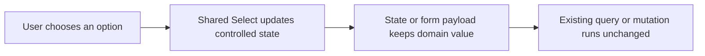

# Dropdown UI Modernization Optimization Record

## Relevant Code Map

- [Canonical Select primitive](../../../packages/ui/src/primitives/select.tsx)
- [React Hook Form Select wrapper](../../../packages/ui/src/components/forms/FormSelect.tsx)
- [Outreach Tracker dropdowns](../../../apps/web/src/components/uhp/UhpClientTrackerPage.tsx)
- [Client detail dropdowns](../../../apps/web/src/components/uhp/UhpClientDetailDialog.tsx)
- [Extensible source dropdown](../../../apps/web/src/components/uhp/UhpSourceSelect.tsx)
- [Volume Points category dropdown](../../../apps/web/src/components/uhp/UhpVolumePointsPage.tsx)
- [UHP dropdown regression test](../../../tests/components/uhp-modern-selects.test.ts)
- [AI Spending dropdowns](../../../apps/web/src/app/(app)/(employee)/ai-spending/page.tsx)
- [Performance Cycles quarter dropdown](../../../apps/web/src/app/(app)/(admin)/admin/performance/cycles/page.tsx)

## Records

### Implemented — 2026-10-07: UHP dropdown consistency

- Problem/evidence: The web app already has a polished, keyboard-accessible Radix Select, but 20 raw HTML selects remained. Twelve were concentrated in UHP, producing visibly inconsistent triggers and menus in the currently reviewed workflow.
- Delivered solution: Replaced every UHP raw select with the shared Select family. Sentinel values preserve nullable choices without passing empty values to Radix; controlled activity-form state preserves the automatic appointment suggestion and submitted API payload.
- Code paths: UHP tracker, client detail, source selector, Volume Points page, shared Select primitive, and regression test listed above.
- Validation: Web TypeScript passed; the UHP dropdown regression test passed; Biome reported warnings only and no errors. Browser click testing remains recommended because Select content is portaled.

### Implemented — 2026-10-07: Application-wide completion

- Problem/evidence: After the UHP pass, seven raw selects remained in AI Spending and one in Performance Cycles.
- Delivered solution: Converted all eight to the shared Select while preserving controlled filter/form state, numeric page-size conversion, provider loading/empty behavior, currency unions, quarter unions, and derived cycle date ranges. Expanded the regression test to scan every web TSX file for native selects.
- Code paths: AI Spending, Performance Cycles, canonical Select, and regression test listed above.
- Validation: Repository search found zero raw selects under `apps/web/src`; web TypeScript passed; the 11-test focused suite passed; focused Biome lint reported warnings only and no errors. Browser interaction testing remains recommended for portaled menus.

## Visual Guide

## Change Log

- 2026-10-07: Counted 20 native selects, modernized all 12 UHP controls, and deferred eight unrelated controls with explicit resume conditions.
- 2026-10-07: Completed the remaining eight conversions and upgraded the regression test to enforce modern dropdown usage application-wide.
