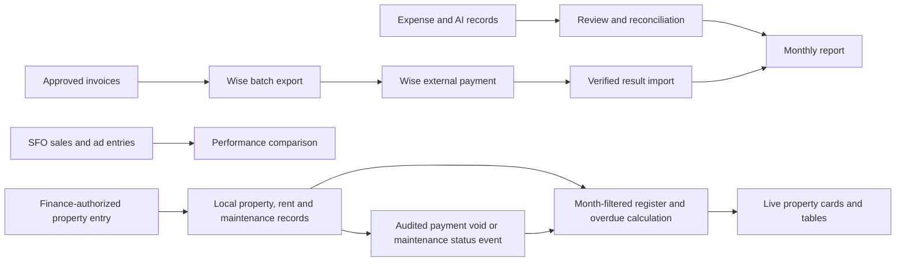

# Finance Redesign Optimization

## Current Status

Finance and Properties migrations are applied to local and production Supabase. The live Properties register remains empty by default and CRM remains unchanged. Historical property-term and month-end gate rules, full cross-role visual review, and real Wise file verification remain open in the [task tracker](task-tracker.md) and [pending decisions](pending-decisions.md). A populated local AI fixture and read-only production reconciliation passed.

## Relevant Code Map

- [Expense pages](../../../apps/web/src/app/(app)/(admin)/admin/expenses/page.tsx), [expense API](../../../apps/web/src/app/api/expenses/route.ts), [expense schema](../../../apps/web/src/lib/schemas/expense.schema.ts)
- [AI spending](../../../apps/web/src/app/(app)/(employee)/ai-spending/page.tsx), [invoice approval](../../../apps/web/src/app/api/invoices/[id]/approve/route.ts), [Wise execution](../../../apps/web/src/app/actions/execute-payroll.ts)
- [Expense report](../../../apps/web/src/lib/expenses/monthly-report.ts), [ad spend](../../../apps/web/src/app/(app)/(admin)/admin/marketing/ad-spend/page.tsx), [forecast](../../../apps/web/src/lib/revenue-forecast.ts)
- [Expense report tests](../../../tests/lib/expenses-monthly-report.test.ts), [expense verification tests](../../../tests/api/expenses-verify-route.test.ts)
- [Finance routes](../../../apps/web/src/app/(app)/finance/page.tsx), [Wise result import](../../../apps/web/src/app/api/finance/wise-batches/[id]/results/route.ts), [Finance migration](../../../supabase/migrations/20261007000003_finance_redesign_foundation.sql), [local SQL checks](../../../tests/sql/finance-redesign-local.sql), [populated AI reconciliation fixture](../../../tests/sql/finance-ai-reconciliation-local.sql)
- [SFO view](../../../apps/web/src/app/(app)/sfo/performance/page.tsx), [forecast test](../../../tests/lib/revenue-forecast-finance.test.ts), [Wise result test](../../../tests/api/finance-wise-results-route.test.ts)
- [Shared Marketing dashboard](../../../apps/web/src/components/marketing/MarketingAdSpendDashboard.tsx), [admin route wrapper](../../../apps/web/src/app/(app)/(admin)/admin/marketing/ad-spend/page.tsx), [SFO CRM access test](../../../tests/pages/sfo-performance-crm.test.tsx)
- [Finance overview](../../../apps/web/src/app/(app)/finance/page.tsx), [overview calculations](../../../apps/web/src/lib/finance/overview.ts), [overview tests](../../../tests/lib/finance-overview.test.ts), [month-aware budget editor](../../../apps/web/src/components/finance/FinanceCatalogPanel.tsx)
- [Filtered expense ledger](../../../apps/web/src/app/(app)/finance/expenses/page.tsx), [CSV export API](../../../apps/web/src/app/api/finance/expenses/export/route.ts), [export tests](../../../tests/api/finance-expense-export-route.test.ts), [page tests](../../../tests/pages/finance-redesign-pages.test.tsx)
- [Invoice register](../../../apps/web/src/components/finance/FinanceInvoiceRegister.tsx), [invoice UI tests](../../../tests/components/FinanceInvoiceRegister.test.tsx), [staff payments](../../../apps/web/src/app/(app)/finance/staff-payments/page.tsx), [Wise batches](../../../apps/web/src/components/finance/FinanceWiseBatches.tsx), [report controls](../../../apps/web/src/components/finance/FinanceReportControls.tsx)
- [Property page](../../../apps/web/src/app/(app)/finance/properties/page.tsx), [property panel](../../../apps/web/src/components/finance/FinancePropertiesPanel.tsx), [property API](../../../apps/web/src/app/api/finance/properties/route.ts), [property calculations](../../../apps/web/src/lib/finance/properties.ts), [local migration](../../../supabase/migrations/20261007000009_finance_properties.sql), [API tests](../../../tests/api/finance-properties-route.test.ts), [calculation tests](../../../tests/lib/finance-properties.test.ts), [page tests](../../../tests/pages/finance-redesign-pages.test.tsx)
- [Property corrections API](../../../apps/web/src/app/api/finance/properties/corrections/route.ts), [correction migration](../../../supabase/migrations/20261007000010_finance_property_corrections.sql), [correction SQL checks](../../../tests/sql/finance-property-corrections-local.sql), [correction API tests](../../../tests/api/finance-property-corrections-route.test.ts), [property UI tests](../../../tests/components/FinancePropertiesPanel.test.tsx), [navigation tests](../../../tests/components/finance-properties-navigation.test.tsx)
- [Wise eligibility tests](../../../tests/api/finance-wise-batch-eligibility-route.test.ts), [Wise batch API](../../../apps/web/src/app/api/finance/wise-batches/route.ts), [Wise template export](../../../apps/web/src/app/api/finance/wise-batches/[id]/export/route.ts)
- [SFO CRM signpost](../../../apps/web/src/app/(app)/sfo/performance/page.tsx), [access tests](../../../tests/pages/sfo-performance-crm.test.tsx), [Finance sidebar](../../../packages/ui/src/layout/Sidebar.tsx), [mutation classification](../../apps/web/architecture/optimistic-ui.md)
- [Prototype HTML](../../../SN%20Control%20Hub%20-%20Finance%20Redesign%20(Faye%20Domingo_Accounting%20Intern).html.html), [subscriptions](../../../apps/web/src/components/finance/FinanceCatalogPanel.tsx), [staff payments](../../../apps/web/src/app/(app)/finance/staff-payments/page.tsx), [report pack](../../../apps/web/src/components/finance/FinanceReportControls.tsx), [SFO charts](../../../apps/web/src/components/marketing/MarketingAdSpendDashboard.tsx)

## Entries

| Status | Problem and evidence | Solution | Code paths | Validation or resume condition |
| --- | --- | --- | --- | --- |
| Audited | Playwright desktop review of proposed prototype screens exposes UI-flow gaps: Overview upcoming/card split, Expenses receipt column, subscription seats/last-charge/checks, Properties paid-on rent table column, Staff Payments amount privacy, Reports period views and snapshot-aligned draft/final CSV, and SFO prior-year sales, stacked platform spend, monthly spend-share trend/table and illustrative gross-margin what-if. Existing aggregate spend share, live PDF, and single-series bars do not reproduce those views. | Preserve real-data and verified-payment constraints; scope any follow-up UI to available source data, label illustrative calculations, and avoid pretending missing records are zero. | Prototype HTML; Finance overview/expense/property pages and panels, FinanceCatalogPanel, staff-payments page, FinanceReportControls, MarketingAdSpendDashboard | Prototype navigation/screenshots and targeted component inspection completed 2026-10-07; implementation and live side-by-side remain pending because local UI did not respond. |
| Implemented | Separate AI spending and expense stores risk duplicate counts. | Copy and sync AI rows by immutable source ID; enforce uniqueness and show them in the expense ledger. | Finance migration, AI trigger, expense UI, populated AI SQL fixture | Local rollback-only fixture passed for three populated rows; read-only production reconciliation found one AUD source for 50.00 and one matching active ledger row, with no duplicate, missing, mismatched or orphan IDs. |
| Implemented | Invoice approval previously triggered Wise execution. | Approval now stops before payment; stored batch export and verified result import update Paid only for Wise `outgoing_payment_sent`. | Invoice approval, Wise batch API/UI and migration | Focused partial/duplicate result test passed; real Wise template and in-flight local fixtures remain pending. |
| Implemented | Month-end reports lacked retained final state. | Store dated drafts and immutable final snapshots; block finalization on pending expense approvals, unmatched requests, or variances. | Monthly report builder, Finance report API, migration | Rollback-only local SQL finalization assertions passed. Evaluate Wise/payment exceptions before rollout. |
| Implemented | SFO sales and spend could imply missing months were zero or mix noncomparable periods. | Separate charts, explicit missing-month messages, comparable sales/spend ratio, actual-versus-forecast progress, and corrected record-month labels. | Ad spend UI/API, forecast library | Web typecheck and focused forecast test passed; manual UI review remains. |
| Implemented | The Finance overview scaffold omitted the prototype's action strip, ranked category bars, budget alerts, month picker, and comparison; prototype figures were illustrative. | Render those sections from current and preceding `finance_overview` RPC results, guard missing baseline and zero-budget cases, and carry the selected month into budget editing. | Finance overview page/calculations/tests, Finance expenses page, catalog panel | Six focused test files (10 tests) and web typecheck passed; authenticated visual walkthrough remains. |
| Implemented | Remaining routes exposed a bare ledger, duplicated legacy headings, and little of the prototype's review/payment/report hierarchy; sample Wise actions would incorrectly mark Paid without verification. | Add Finance-styled expense tabs and category/vendor/month filters, subscription KPIs, staff invoice table and actual-status cards, Wise payout stages, month-aligned report chart and snapshot pack, and SFO route-specific heading; keep the legacy advanced views accessible without crowding the primary view. | Expense/staff/report/SFO pages, Finance invoice/catalog/Wise/report components, page and invoice UI tests | Nine focused test files (17 tests) and web typecheck passed. Manual authenticated visual parity remains; Wise verification remains server-confirmed. |
| Implemented | A Finance expense CSV button needed complete, filtered results without spreadsheet formula execution or a silently partial download. | Export through a finance-authorized API using paginated reads and shared CSV escaping; surface oversized/incomplete export errors, and retain the selected ledger filters. | Finance expense export API, export control, CSV helper, export test | Three export route tests and web typecheck passed; no populated local ledger available for manual download. |
| Implemented | The Properties prototype contained illustrative names, balances and overdue claims, and there was no property data store or route. | Keep the register empty by default; authorize server-side reads/writes, capture real property/rent/maintenance records, compute monthly equivalents and overdue only from the selected period's recorded balances and due dates, and refuse truncated reads. Keep new entries server-confirmed and audit identifiers without financial/tenant details. | Property page/panel/API, calculation helper, local migration, property tests, Finance navigation | Local migration applied, three tables empty and RLS/grants verified by SQL; 17 focused Finance tests across seven files and web/UI typechecks passed. Authenticated empty-state/mobile-width inspection passed; actual populated-data browser write not exercised. |
| Implemented | CRM already existed behind independent access control; a redesign duplicate would fragment records and authorization. | Leave CRM untouched and provide an access-aware signpost from SFO Performance for users with existing CRM rights. | SFO view and CRM access tests | Two focused tests and web typecheck passed; CRM itself was not changed. |
| Deferred | Current property occupancy and weekly rent are not effective-dated, so earlier months would be recalculated from current terms after edits; there is no agreed mid-month rent rule. | Add effective-dated property terms once the [pending decision](pending-decisions.md) is answered. Until then, do not enable term edits and label historical calculations as current-term estimates. | Property migration, calculation helper, panel | Resume when effective-date/proration rules are agreed; verify unchanged historical totals after term edits. |
| Implemented | Mistaken rent entries inflated received amounts; maintenance status updates lacked an audit trail. | Retain voided rent rows with a required reason and actor, exclude them from received rent, and progress maintenance status atomically with expected-state checks and retained history. Actions are Finance-authorized and server-confirmed. | Correction migration/API, property register/calculations, local SQL/API/UI tests | Rollback-only local SQL, focused correction/API/UI tests and web/UI typechecks passed; correction migration applied to production. No sample property records were imported. |
| Implemented | Approved invoices may already have Wise payments or batches, while duplicate selections and ambiguous recipient rows could produce incorrect exports. | Align queue eligibility with the creation RPC, reject duplicate selections and missing/duplicated saved-recipient rows. | Wise batch API/export, eligibility tests | Eight focused Wise tests and web typecheck passed; a real Wise file/result remains unavailable. |
| Implemented | Finance migrations and populated production AI records needed explicit verification. | Apply the reviewed pending migrations including separately authorized UHP prerequisite, inspect production migration history, and reconcile production source/ledger records read-only. | Finance migrations 00003/00005/00006/00007/00009/00010, UHP 00002, AI fixture | Production dry-run reports up to date; one source and one matching active AUD 50.00 ledger entry, zero duplicates/missing/mismatched/orphans, four property-related tables empty. No manual backfill or Wise transfer. |

## Visual Guide

## Change Log

- 2026-10-07: Visually audited the proposed prototype in Playwright across Finance and SFO desktop screens (including subscription and maintenance tabs), then compared targeted implementation components. Logged missing UI-flow details above; the local Finance HTTP endpoint did not respond, so live-app visual parity and responsive comparison remain outstanding. No app behavior or schema changed.
- 2026-10-07: Audited and ran the populated AI migration-equivalent backfill and trigger reconciliation fixture on LOCAL only. Three source rows reconciled by currency; repeated backfill and duplicate IDs did not create extra rows; updates and soft deletion reconciled two active rows. Rollback preserved the empty local database. No migration change was required; actual populated production reconciliation remains deferred.
- 2026-10-07: Audited the prototype against existing routes, then implemented the local Finance/SFO flow. Local migration, rollback-only SQL checks, focused tests, and web/UI typechecks passed. Remaining checks are listed in the tracker; production was not touched.
- 2026-10-07: Added live-data monthly overview comparisons, category/budget visual cues, and month-aware budget editing without using sample prototype figures. Focused tests and web typecheck passed; visual verification remains.
- 2026-10-07: Extended the prototype's live-data layout over the other scoped pages; avoided mock payouts, exposed CSV error states, and preserved old detailed management views behind disclosures. Nine focused test files (17 tests) and web typecheck passed. No authenticated local UI was available for visual comparison.
- 2026-10-07: Kept CRM unchanged with conditional SFO navigation. Added the live Properties register, monthly complete-read guard, RLS-protected local schema, calculation/API/page tests and server-confirmed forms. Local migration/SQL RLS and empty-state checks passed, as did 17 focused Finance tests across seven files, web/UI typechecks, and scoped lint with warnings only. Desktop empty-state, mobile form and route headings for Finance, SFO and existing CRM were checked in an authenticated local browser; graph refreshed to 12,702 nodes/31,204 edges. Historical term versioning and correction workflows remain deferred; prototype sample records were not imported and production was not touched.
- 2026-10-07: Added audited rent voids/maintenance status events, corrected role-aware Properties navigation, and tightened Wise batch eligibility and template handling. After explicit approval, applied seven pending production migrations (UHP 00002 plus six Finance versions); migration history and dry-run confirmed up to date. Production read-only AI source/ledger count and amount reconciled 1:1 for AUD 50.00, with zero duplicate/missing/mismatched/orphan IDs and no property records. Local correction SQL, 24 focused tests across eight files, and web/UI typechecks passed before deployment; historical term and month-end finalization business rules remain pending, and no Wise transfer was run.
- 2026-10-07: Final local verification passed 27 focused tests in nine files, rollback-only AI/property SQL, web/UI typechecks, scoped Biome (warnings only), and Graphify refresh (12,822 nodes/31,426 edges). Authenticated browser confirmed Properties empty/mobile state and Overview action queue/nav; the local UI server subsequently reset/timed out navigating to Reports, so the remainder of the visual walkthrough is still open. Production migrations only do not publish application code. See the tracker for pending historical-rent/month-end policy choices and external Wise fixture validation.
