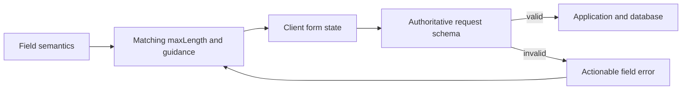

# Input Validation Optimization Record

## Current Status

Implemented a layered input-size policy to improve reliability and error recovery without imposing one arbitrary global limit.

## Relevant Code Map

- [Input audit script](../../../scripts/audit/input-text-limits.mjs) - inventories JSX text controls and reports missing explicit bounds.
- [Report schema](../../../apps/web/src/lib/schemas/report.schema.ts), [employee schema](../../../apps/web/src/lib/schemas/employee.schema.ts), [performance schema](../../../apps/web/src/lib/schemas/performance.schema.ts), and [resource schema](../../../apps/web/src/lib/schemas/resource.schema.ts) - representative authoritative domain limits.
- [Marketing report editor](../../../apps/web/src/components/reports/MarketingReportEditor.tsx), [task form](../../../packages/ui/src/components/tasks/TaskForm.tsx), and [report form](../../../packages/ui/src/components/reports/ReportForm.tsx) - representative matching client limits.
- [Schema limit tests](../../../tests/text-input-schema-limits.test.ts) - representative boundary coverage across feature domains.

## Optimizations

### Implemented - Domain-specific limits at both UI and request boundaries

- Problem/evidence: controls and schemas used inconsistent or absent boundaries, allowing users to compose payloads that failed only after submission with generic errors.
- Delivered solution: short fields use tight semantic caps (for example, tags 50 and names 120), searches use 200, titles generally use 200-300, URLs use 2,048, descriptions and narratives use 1,000-10,000 depending on purpose, and unusually large knowledge content remains explicitly bounded. The API schema remains authoritative.
- Relevant paths: schema modules under `apps/web/src/lib/schemas`, route-local request schemas under `apps/web/src/app/api`, and corresponding UI controls in `apps/web` and `packages/ui`.
- Validation: the AST audit found explicit limits on 324 of 330 controls; the six remaining entries are generic wrappers/primitives or conditional date/numeric controls. Seventy-seven focused tests and web typecheck passed.

### Implemented - Repeatable audit rather than manual-only review

- Problem/evidence: text controls are distributed across app pages and the shared UI package, making regressions easy to miss.
- Delivered solution: an AST-based audit command reports every text-capable JSX control, its field/value expression, and whether an explicit `maxLength` exists.
- Relevant path: `scripts/audit/input-text-limits.mjs`.
- Validation: `node scripts/audit/input-text-limits.mjs --summary` audited 330 controls.

## Visual Guide

## Change Log

- 2026-10-06: Audited all JSX text controls, implemented semantic client/server bounds, added a reusable audit script and representative schema tests, and documented the six intentional exceptions.
