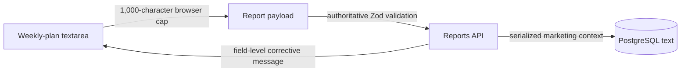

# Marketing Reporting Optimization Record

## Current Recommendation

Implemented: weekly-plan items use a 1,000-character per-item limit enforced by both browser and server. This is generous enough for a detailed task while keeping each entry operational rather than turning the plan into an unbounded document.

## Relevant Code Map

- [Weekly-plan editor](../../../apps/web/src/components/reports/MarketingReportEditor.tsx) - multiline entry, disclosed limit, counter, and inline validation.
- [Report schema](../../../apps/web/src/lib/schemas/report.schema.ts) - authoritative item, metric, and notes limits.
- [API error adapter](../../../apps/web/src/lib/api-error.ts) - extracts the first actionable Zod field/form message.
- [Create-report hook](../../../apps/web/src/hooks/useCreateReport.ts) and [update-report hook](../../../apps/web/src/hooks/useUpdateReport.ts) - use the shared API error adapter.
- [Boundary tests](../../../tests/report-input-limits.test.ts) and [API error tests](../../../tests/api-error.test.ts) - exercise the request contract and error mapping.

## Findings

### Implemented - Weekly-plan item length and error recovery

- Problem/evidence: the request schema rejected items above 300 characters, but the editor did not disclose that boundary and reduced detailed validation failures to `Invalid request body`.
- Delivered solution: one exported 1,000-character constant drives server validation and the client `maxLength`; the editor uses multiline fields, announces the boundary, shows a count near it, validates legacy/programmatic over-limit values inline, and maps nested API validation details to a useful message.
- Relevant paths: editor, report schema, create/update hooks, API error adapter, and focused tests.
- Validation: 13 focused Vitest tests passed; `pnpm --filter @hr-portal/web typecheck` passed.

## Visual Guide

## Change Log

- 2026-10-06: Implemented the shared weekly-plan limit, inline UX, and actionable API validation errors. No database schema change was needed.
