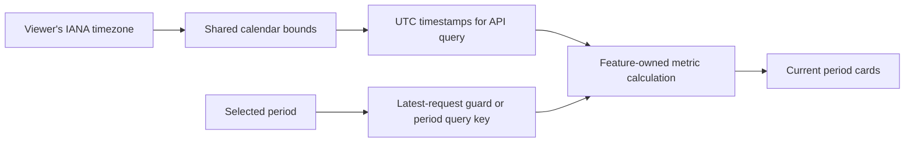
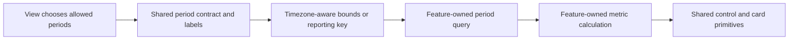

# Metrics Period Consistency Optimization Record

## Relevant Code Map

- [Shared calendar bounds and year options](../../../apps/web/src/lib/metrics-period.ts)
- [Controlled metrics-period selector](../../../apps/web/src/components/data-display/MetricsPeriodSelect.tsx)
- [Latest-period request guard](../../../apps/web/src/hooks/usePeriodRequestGuard.ts)
- [Calendar and timezone tests](../../../tests/lib/metrics-period.test.ts)
- [Rapid-switch guard test](../../../tests/hooks/usePeriodRequestGuard.test.tsx)
- [Selector accessibility test](../../../tests/components/MetricsPeriodSelect.test.tsx)
- [UHP Outreach selector, bounds, and request state](../../../apps/web/src/components/uhp/UhpClientTrackerPage.tsx)
- [UHP Outreach metrics API](../../../apps/web/src/app/api/uhp/clients/metrics/route.ts)
- [UHP Outreach digest window](../../../apps/web/src/app/api/uhp/clients/digest/route.ts)
- [UHP Outreach metric calculation](../../../apps/web/src/lib/uhp.ts)
- [UHP Volume Points month selector and paired requests](../../../apps/web/src/components/uhp/UhpVolumePointsPage.tsx)
- [UHP Volume Points summary API](../../../apps/web/src/app/api/uhp/volume-points/summary/route.ts)
- [Marketing Ad Spend year selector and requests](../../../apps/web/src/components/marketing/MarketingAdSpendDashboard.tsx)
- [AI Spending year selector and local calculation](../../../apps/web/src/app/(app)/(employee)/ai-spending/page.tsx)
- [Leaderboard period query hook](../../../apps/web/src/hooks/useGamification.ts)
- [Leaderboard calendar-month API](../../../apps/web/src/app/api/leaderboard/route.ts)
- [Expense Analytics weekly/monthly buckets](../../../apps/web/src/app/api/dashboard/analytics/route.ts)
- [Existing scope selector primitive](../../../apps/web/src/components/data-display/FilterControls.tsx)
- [PA Tasks filters without period metrics](../../../apps/web/src/app/(app)/(employee)/pa-tasks/page.tsx)

## Records

### Implemented — 2026-10-08: Shared periods and selected-period request safety

- Problem/evidence: Relative period boundaries, year choices, and selector markup were repeated; UHP Volume Points and Marketing Ad Spend could apply responses from an earlier selection after the user switched periods. A single global timezone would place Italy and Australia users in the wrong local month near a boundary.
- Delivered solution: `calendarPeriodBounds` resolves a viewer's IANA timezone and returns UTC instants for the local calendar week/month/quarter/year, including daylight-saving transitions. `calendarMonthKey` and `yearPeriodOptions` provide consistent defaults and choices. A controlled `MetricsPeriodSelect` renders feature-supplied choices. `usePeriodRequestGuard` accepts only the latest request for the currently selected period. UHP Outreach uses explicit viewer-local bounds; Volume Points defaults to the viewer's month and hides old-month data while loading; Marketing hides old-year data and applies its paired results together; AI Spending shares year options; Leaderboard includes the viewer timezone in its query key and month request. Expense Analytics remains UTC because its week/month control changes bucket granularity, and scheduled UHP digests retain their business schedule/window.
- Code paths: Shared utilities, selector, guard, UHP, Marketing, AI Spending, Leaderboard, and tests linked in Relevant Code Map.
- Validation: Web TypeScript and focused period, selector, guard, and UHP reply tests passed. The local production build and before/after latency measurement are recorded below. Browser click-testing is still useful for layout and rapid interaction checks; no database migration was required.

#### Measurements

- Date: 2026-10-08. Local Next.js production build on port 3101 and local Supabase; admin role; 30 samples and 3 warmups per target; commit `4daae26` with a dirty worktree. The valid before run is `perf-results/metrics-period-consistency/2026-10-08T00-02-50-302Z-before-valid.json`. The first attempted baseline used an encoded `&` in the UHP query and returned 400 for that target, so it was rejected.
- After run: `perf-results/metrics-period-consistency/2026-10-08T00-15-23-924Z-after.json`; same local build setup, role, target set, and 30-sample count. All targets returned HTTP 200 in both valid runs. Total-response p50/p95 (before → after; delta): Outreach page 60.2/78.6 → 66.4/84.1 ms (+6.2/+5.4); Outreach metrics API 55.3/73.2 → 52.0/66.4 ms (-3.3/-6.8); Volume Points summary 53.2/75.1 → 47.6/62.4 ms (-5.6/-12.7); Marketing ad spend 64.5/90.7 → 59.3/73.9 ms (-5.2/-16.8); unaffected notifications control 55.4/79.5 → 51.8/71.9 ms (-3.7/-7.6). The control moved as well, so these numbers do not establish a causal server-speed improvement. The single login sample is not a reliable latency comparison.

### Audited — 2026-10-08: Period semantics and request ownership

- Problem/evidence: Each metrics view owns its own period values and rendering. UHP Outreach computes browser-local week/month/quarter starts and sends ISO bounds; its metrics API defaults to a UTC month if bounds are absent. Its digest uses a rolling seven-day window with the same metric summary. Volume Points uses a `YYYY-MM` reporting-month key initialized from UTC. Marketing Ad Spend offers year/all-time and reloads from the server. AI Spending offers year/all-time but filters already loaded expenses in the browser. Leaderboard uses all-time/current-month with a period-keyed TanStack Query. Expense Analytics groups by UTC calendar week/month. PA Tasks has no period metrics selector. These are distinct period meanings despite similar controls.
- Proposed solution: Introduce a small, typed period contract that states kind (`calendar-week`, `calendar-month`, `calendar-quarter`, `calendar-year`, `rolling-days`, `all-time`, or `custom`), timezone, and explicit inclusive/exclusive bounds or reporting key. Put label and boundary calculation in one pure utility. Use the existing Select/FilterSelect primitives for a thin controlled period selector that accepts each view's allowed options. Keep metric aggregation and API contracts in their feature modules. Prefer period-keyed TanStack Query for server-backed metric views; give each feature its own query key and mutation reconciliation behavior.
- Code paths: All files in Relevant Code Map; a future shared period utility belongs in the web app's date/metrics library, while a selector can live among reusable data-display controls.
- Validation/resume condition: Static code-path audit only. Before implementation, define the product timezone for "This week/month/quarter" (browser-local versus Asia/Manila), then test Monday/month/quarter boundaries, timezone transitions, rapid period switching, failed requests, and mutation reconciliation. No latency was measured or claimed because this audit changed no runtime behavior; measure before and after any implementation that changes fetch timing or query cost.

| View | Current period model | Data path | Audit finding |
| --- | --- | --- | --- |
| UHP Outreach | Current local week/month/quarter through now | Explicit `from`/`to` GET; guarded request ID | API default uses UTC month; digest's "week" is rolling seven days, so labels need an explicit contract. |
| UHP Volume Points | Chosen `YYYY-MM` reporting month | Summary and entries GET together | UTC-derived initial month; a slow old request can replace a newer month; summary and entries can be mixed during a race. |
| Marketing Ad Spend | Year or all-time | Manual server reload plus revenue comparison | A slow old request can replace the selected year's data; two independent responses are coupled to one loader. |
| AI Spending | Year or all-time | Client-side filter of loaded expenses | Similar year selector to Marketing but different data ownership and available start year (2026 versus 2024). |
| Leaderboard | All-time or current month | Period-keyed TanStack Query | Already has a reusable request lifecycle; its points metric has separate domain semantics. |
| Expense Analytics | UTC week/month buckets | API aggregation | "By week/month" changes grouping granularity, not the same current-period filter as UHP. |
| PA Tasks | No metric period | Filtered task query | Outside a period-metrics abstraction today. |

## Visual Guide

## Change Log

- 2026-10-08: Implemented viewer-local calendar boundaries, shared selector/year options, and latest-period response handling across UHP, Marketing, AI Spending, and Leaderboard. Compared 30-sample local production-build before/after runs, including an unaffected control; no causal speed improvement claimed.
- 2026-10-08: Completed the cross-view DRY audit, identified boundary and request-race inconsistencies, and recorded a scoped shared-period design. No implementation or latency claim.
