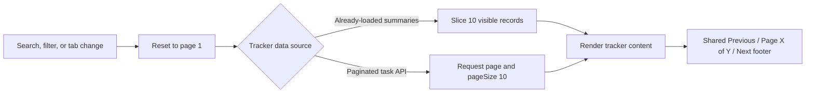

# Tracker Pagination Optimization

## Current Status

Pagination is implemented for the long record views in PA Tasks, UHP Outreach, CRM, and Work Tracker. The rollout standardizes perceived density and prevents the Work Tracker execution board from loading 200 task cards at once.

## Optimization Entries

### Shared pagination controls
- **Status:** Implemented
- **Problem / evidence:** Tracker views used repeated or missing pagination controls, producing inconsistent navigation and unbounded page height.
- **Solution:** Reuse one centered Previous / Page X of Y / Next footer with consistent boundary and loading states.
- **Relevant paths:** [TrackerPagination.tsx](../../../apps/web/src/components/data-display/TrackerPagination.tsx), [PA Tasks](../../../apps/web/src/app/(app)/(employee)/pa-tasks/page.tsx), [component tests](../../../tests/components/TrackerPagination.test.tsx)
- **Validation:** `pnpm --filter web typecheck`; `pnpm vitest run tests/components/TrackerPagination.test.tsx` (3 passed).

### Record-heavy tracker views
- **Status:** Implemented
- **Problem / evidence:** UHP Outreach and CRM rendered every fetched result, while Work Tracker execution requested up to 200 tasks for one board.
- **Solution:** Show 10 records per page. UHP and CRM paginate their already-loaded filtered results; Work Tracker execution sends page and page-size parameters to its existing paginated task API. Work Tracker staff and roadmap summaries paginate locally.
- **Relevant paths:** [UHP Outreach](../../../apps/web/src/components/uhp/UhpClientTrackerPage.tsx), [CRM](../../../apps/web/src/components/crm/CrmPageContent.tsx), [Work Tracker](../../../apps/web/src/app/(app)/(employee)/work-tracker/page.tsx)
- **Validation:** `pnpm --filter web typecheck`; focused shared-control tests. Resume condition for visual validation: current authenticated local browser state.

### Existing tracker coverage
- **Status:** Audited
- **Problem / evidence:** AI Spending already displays the requested control pattern, so another pagination implementation would not change its UX.
- **Solution:** Leave its current pagination behavior unchanged and avoid unrelated refactoring.
- **Relevant paths:** [AI Spending Tracker](../../../apps/web/src/app/(app)/(employee)/ai-spending/page.tsx)
- **Validation:** Source inspection confirmed Previous, Page X of Y, and Next controls with boundary states.

## Relevant Code Map

- [Shared tracker footer](../../../apps/web/src/components/data-display/TrackerPagination.tsx) - presentation, loading state, and page boundaries.
- [PA Task Tracker](../../../apps/web/src/app/(app)/(employee)/pa-tasks/page.tsx) - server-paginated reference implementation.
- [UHP Outreach](../../../apps/web/src/components/uhp/UhpClientTrackerPage.tsx) - client-side pages over filtered client results.
- [CRM Tracker](../../../apps/web/src/components/crm/CrmPageContent.tsx) - independent SFO and TECH page state.
- [Work Tracker](../../../apps/web/src/app/(app)/(employee)/work-tracker/page.tsx) - local summary pages and server-backed execution pages.
- [Pagination tests](../../../tests/components/TrackerPagination.test.tsx) - labels, navigation, boundaries, and loading behavior.

## Visual Guide

## Change Log

- 2026-10-06: Audited tracker pagination, implemented the shared footer and four-area rollout, and recorded the client-side versus server-side pagination tradeoff. Authenticated visual verification remains deferred.
