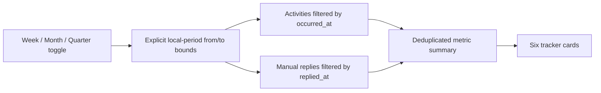
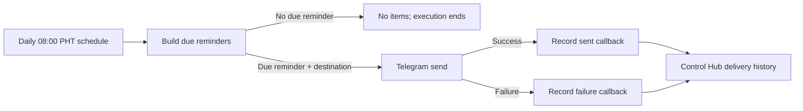

# Ultimate Health Project Optimization Record

## Relevant Code Map

- [Reminder schedule and history API](../../../apps/web/src/app/api/uhp/reminders/route.ts)
- [Authenticated n8n callback route](../../../apps/web/src/app/api/uhp/reminders/runs/route.ts)
- [Callback secret validation](../../../apps/web/src/app/api/uhp/_lib.ts)
- [Reminder workflow definition](../../../n8n/workflows/uhp-herbalife-portal-reminders.json)
- [Workflow regression tests](../../../n8n/workflows/uhp-workflows.test.ts)
- [Reminder-date calculation tests](../../../apps/web/src/lib/uhp-reminders.test.ts)
- [Outreach Tracker period selector](../../../apps/web/src/components/uhp/UhpClientTrackerPage.tsx)
- [Outreach metrics endpoint](../../../apps/web/src/app/api/uhp/clients/metrics/route.ts)
- [Period-filtered outreach data](../../../apps/web/src/app/api/uhp/_lib.ts)
- [Outreach summary calculation](../../../apps/web/src/lib/uhp.ts)
- [Reply timestamp migration](../../../supabase/migrations/20261007000002_add_replied_at_to_uhp_clients.sql)
- [Period query regression test](../../../tests/api/uhp-outreach-period.test.ts)
- [Application-wide dropdown regression test](../../../tests/components/uhp-modern-selects.test.ts)

## Records

### Audited — 2026-10-02: Delivery readiness and observability

- Problem/evidence: The live reminder workflow was inactive, had no configured Telegram destinations, and had no executions. Its Code node correctly returns no items when no reminder is due, which can look like a failed workflow unless understood.
- Solution: Keep the empty-output behavior (it prevents off-schedule messages), document the expected schedule, and require the first delivery to be verified through both Telegram and Control Hub history before activation.
- Code paths: reminder workflow and callback API listed above.
- Validation/resume condition: Live inspection confirmed 08:00 PHT scheduling, Header Auth on both callbacks, a connected failure branch, and zero destinations/executions. Resume when a chat ID is configured; validate a sent or failed delivery record after a due-date test.

### Planned: Callback resilience

- Problem/evidence: A Telegram failure is recorded, but callback HTTP requests have no configured retry policy; a transient Control Hub outage could leave a send unrecorded.
- Proposed solution: Define and test an n8n retry/error-handling policy for the two callback nodes before increasing recipient volume.
- Code paths: [reminder workflow](../../../n8n/workflows/uhp-herbalife-portal-reminders.json).
- Validation/resume condition: Resume after the first successful production delivery establishes baseline behavior; verify retries do not create duplicate history records because `idempotency_key` is already used.

### Implemented — 2026-10-07: Strict metric-period filtering

- Problem/evidence: Activity-based cards already constrained `occurred_at`, but the manual Replied checkbox exposed only a durable boolean. Reading that current boolean from an outreach row could count an old reply in Week, Month, or Quarter, or miss a reply newly checked during the selected period when its outreach occurred earlier.
- Delivered solution: Store the time when Replied is switched on in `uhp_clients.replied_at`, clear it when switched off, and load timestamp-filtered manual replies alongside activity rows. The client now sends explicit `from` and `to` query bounds and bypasses the browser cache when the period changes.
- Code paths: Outreach Tracker selector, metrics endpoint/data helper, summary calculation, client create/update routes, migration, and focused tests listed above.
- Validation: 10 focused tests passed; web TypeScript passed; the migration applied to local Supabase; read-only local schema inspection confirmed `replied_at timestamptz` and `idx_uhp_clients_replied_at`. Production deployment and UI click-testing are deferred.

### Implemented — 2026-10-07: Consistent modern dropdown interactions

- Problem/evidence: Twelve UHP fields still used browser-native select menus while the application standard is the shared Radix Select, creating inconsistent visuals and interaction behavior in the Outreach Tracker, client dialog, Source picker, and Volume Points form.
- Delivered solution: Converted all UHP dropdowns to the shared Select family. Nullable options use explicit sentinels, and the communication form now preserves its appointment auto-suggestion through controlled state rather than direct DOM mutation.
- Code paths: UHP tracker, client detail, source selector, Volume Points page, and dropdown regression test.
- Validation: Web TypeScript and the focused dropdown regression test passed; Biome reported no errors. Browser click testing remains outstanding.

## Visual Guide

## Change Log

- 2026-10-07: Audited Outreach Tracker period behavior and implemented timestamped, bounded manual-reply metrics; validated locally and left production deployment deferred.
- 2026-10-07: Replaced all 12 native UHP selects with the shared modern dropdown and recorded the remaining cross-feature audit separately.
- 2026-10-02: Audited live workflow deployment state and documented the remaining recipient, activation, and first-delivery verification steps.
