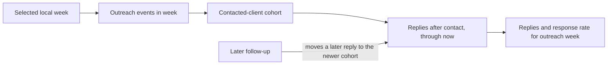
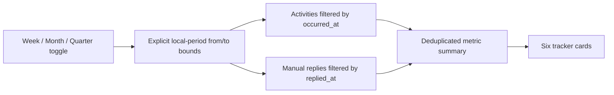
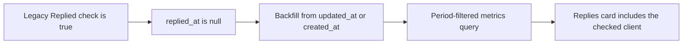
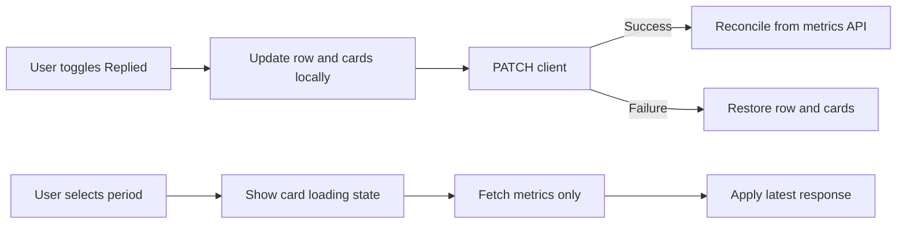
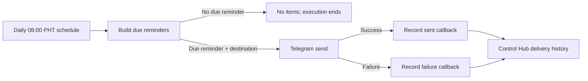

# Ultimate Health Project Optimization Record

## Relevant Code Map

- [Reminder schedule and history API](../../../apps/web/src/app/api/uhp/reminders/route.ts)
- [Authenticated n8n callback route](../../../apps/web/src/app/api/uhp/reminders/runs/route.ts)
- [Callback secret validation](../../../apps/web/src/app/api/uhp/_lib.ts)
- [Reminder workflow definition](../../../n8n/workflows/uhp-herbalife-portal-reminders.json)
- [Workflow regression tests](../../../n8n/workflows/uhp-workflows.test.ts)
- [Reminder-date calculation tests](../../../apps/web/src/lib/uhp-reminders.test.ts)
- [Outreach Tracker period selector](../../../apps/web/src/components/uhp/UhpClientTrackerPage.tsx)
- [Outreach metrics endpoint](../../../apps/web/src/app/api/uhp/clients/metrics/route.ts)
- [Period-filtered outreach data](../../../apps/web/src/app/api/uhp/_lib.ts)
- [Outreach summary calculation](../../../apps/web/src/lib/uhp.ts)
- [Reply timestamp migration](../../../supabase/migrations/20261007000002_add_replied_at_to_uhp_clients.sql)
- [Legacy reply timestamp backfill](../../../supabase/migrations/20261008000001_backfill_uhp_replied_at.sql)
- [Period query regression test](../../../tests/api/uhp-outreach-period.test.ts)
- [Optimistic reply-card unit tests](../../../tests/lib/uhp-outreach-summary.test.ts)
- [Application-wide dropdown regression test](../../../tests/components/uhp-modern-selects.test.ts)
- [Shared calendar bounds](../../../apps/web/src/lib/metrics-period.ts), [period request guard](../../../apps/web/src/hooks/usePeriodRequestGuard.ts), and [Volume Points page](../../../apps/web/src/components/uhp/UhpVolumePointsPage.tsx) - viewer-local period boundaries and latest-response safety.
- [Cohort metrics route](../../../apps/web/src/app/api/uhp/clients/metrics/route.ts), [cohort calculation](../../../apps/web/src/lib/uhp.ts), [cohort API test](../../../tests/api/uhp-outreach-cohort-route.test.ts), [calendar-boundary tests](../../../tests/lib/metrics-period.test.ts), and [cohort summary tests](../../../tests/lib/uhp-outreach-summary.test.ts) - late replies attributed to the selected outreach period.

## Records

### Implemented - 2026-10-08: Outreach-period response cohorts

- Problem/evidence: The former API filtered outreach and replies to the same window. A client contacted last week who replied this week could not improve last week's response rate, and the UI did not offer a Last week choice.
- Delivered solution: Add a viewer-local Last week selection. Outreach attempts and the denominator come from activity logged in the selected window; Replies and Response rate count clients in that outreach cohort who replied after contact, including later periods. A newer follow-up takes ownership of a reply so one event does not inflate both weeks. Other cards remain tied to activity in the selected window. The Updated column remains unrelated. Keep checkbox-derived cards optimistic with rollback; period selection remains server-confirmed. The scheduled digest retains its rolling-window semantics.
- Code paths: Cohort metrics route, calculation, UHP data helper and tracker, shared calendar bounds, and focused tests in Relevant Code Map.
- Validation: 23 focused tests, web typecheck, local production build, and 30-sample local before/after measurements passed. Existing data lacks an immutable history for every manual checkbox toggle; unchecking removes that flag's contribution unless a separate inbound/reply activity exists. Browser click-testing and measurement with representative outreach volume remain useful follow-ups.

#### Measurements

- Before: 2026-10-08, commit `a58925f4` with dirty worktree; local Next.js production build on port 3101, local Supabase, admin role, 30 samples and 3 warmups per target. Valid file: `perf-results/uhp-outreach-cohort/2026-10-08T01-13-08-559Z-before.json`; all three targets returned HTTP 200. Before total-response p50/p95: Outreach page 70.5/157.3 ms, historical-week metrics API 56.0/96.3 ms, unaffected notifications control 56.5/117.9 ms. An earlier attempt failed before sampling because local Supabase was stopped; starting the local stack without its unhealthy optional vector service produced this valid baseline.
- After: `perf-results/uhp-outreach-cohort/2026-10-08T01-23-55-820Z-after.json`; same commit, dirty worktree, local production-build mode, local Supabase, admin role, targets, sample count, and warmups. All targets returned HTTP 200. Total-response p50/p95 before → after (delta): Outreach page 70.5/157.3 → 164.2/231.2 ms (+93.7/+74.0); historical-week metrics API 56.0/96.3 → 86.7/137.8 ms (+30.7/+41.5); unaffected notifications control 56.5/117.9 → 83.0/139.4 ms (+26.6/+21.5). The control and one-off sign-in also slowed substantially, so this run cannot isolate the added query's cost; no speed claim is made. The local dataset may not represent production outreach volume.



### Implemented - 2026-10-08: Viewer-local period boundaries and selected-month safety

- Problem/evidence: A hardcoded Asia/Manila period would give Italy and Australia users the wrong "this month" near a boundary; Volume Points could apply responses for a previously selected month.
- Delivered solution: Shared calendar bounds convert each viewer's IANA week/month/quarter to UTC instants for Outreach. Volume Points starts on the viewer's month but keeps its selected `YYYY-MM` as a canonical reporting key. Both UHP views reject stale period responses; Volume Points hides old-month totals while loading and provides retry after failure.
- Code paths: Shared calendar bounds, period request guard, Outreach selector/API, and Volume Points page in Relevant Code Map.
- Validation: 20 focused cross-feature tests, web typecheck, and local production build passed. Thirty local samples per target showed Outreach page p50/p95 60.2/78.6 → 66.4/84.1 ms, Outreach metrics API 55.3/73.2 → 52.0/66.4 ms, and Volume Points summary 53.2/75.1 → 47.6/62.4 ms. The unaffected notifications control also moved 55.4/79.5 → 51.8/71.9 ms, so no causal speed improvement is claimed. Full setup and run files are in [Metrics Period Consistency](../metrics-period-consistency/optimization.md); browser click-testing remains open.

### Audited — 2026-10-02: Delivery readiness and observability

- Problem/evidence: The live reminder workflow was inactive, had no configured Telegram destinations, and had no executions. Its Code node correctly returns no items when no reminder is due, which can look like a failed workflow unless understood.
- Solution: Keep the empty-output behavior (it prevents off-schedule messages), document the expected schedule, and require the first delivery to be verified through both Telegram and Control Hub history before activation.
- Code paths: reminder workflow and callback API listed above.
- Validation/resume condition: Live inspection confirmed 08:00 PHT scheduling, Header Auth on both callbacks, a connected failure branch, and zero destinations/executions. Resume when a chat ID is configured; validate a sent or failed delivery record after a due-date test.

### Planned: Callback resilience

- Problem/evidence: A Telegram failure is recorded, but callback HTTP requests have no configured retry policy; a transient Control Hub outage could leave a send unrecorded.
- Proposed solution: Define and test an n8n retry/error-handling policy for the two callback nodes before increasing recipient volume.
- Code paths: [reminder workflow](../../../n8n/workflows/uhp-herbalife-portal-reminders.json).
- Validation/resume condition: Resume after the first successful production delivery establishes baseline behavior; verify retries do not create duplicate history records because `idempotency_key` is already used.

### Implemented — 2026-10-07: Strict metric-period filtering

- Problem/evidence: Activity-based cards already constrained `occurred_at`, but the manual Replied checkbox exposed only a durable boolean. Reading that current boolean from an outreach row could count an old reply in Week, Month, or Quarter, or miss a reply newly checked during the selected period when its outreach occurred earlier.
- Delivered solution: Store the time when Replied is switched on in `uhp_clients.replied_at`, clear it when switched off, and load timestamp-filtered manual replies alongside activity rows. The client now sends explicit `from` and `to` query bounds and bypasses the browser cache when the period changes.
- Code paths: Outreach Tracker selector, metrics endpoint/data helper, summary calculation, client create/update routes, migration, and focused tests listed above.
- Validation: 10 focused tests passed; web TypeScript passed; the migration applied to local Supabase; read-only local schema inspection confirmed `replied_at timestamptz` and `idx_uhp_clients_replied_at`. Production deployment and UI click-testing are deferred.



### Implemented — 2026-10-08: Legacy Replied checkbox reconciliation

- Problem/evidence: The table renders the durable `uhp_clients.replied` boolean, while the period-aware Replies card loads manual checks by `replied_at`. Rows checked before that timestamp column existed have `replied = true` and `replied_at = NULL`; the screenshot showed at least three checked rows while the card counted one timestamped reply.
- Delivered solution: A one-time migration fills missing timestamps for checked rows from `updated_at`, falling back to `created_at`. This preserves the Week / Month / Quarter contract while allowing legacy checked rows to enter the appropriate historical period. New checks still receive the exact toggle time from the PATCH route.
- Code paths: [legacy reply timestamp backfill](../../../supabase/migrations/20261008000001_backfill_uhp_replied_at.sql), [period-filtered outreach data](../../../apps/web/src/app/api/uhp/_lib.ts), and [reply toggle route](../../../apps/web/src/app/api/uhp/clients/[id]/route.ts).
- Validation: Applied to local Supabase; local migration history confirmed `20261008000001`; a transaction-scoped legacy fixture produced `timestamp_backfilled = true` and was rolled back; 10 focused UHP tests and web TypeScript passed. Production dry-run listed only `20261008000001`, then the approved push and migration history confirmed it on 2026-10-08.

#### Measurements

- Status: Deferred; no valid before/after delta is claimed.
- Attempted 2026-10-08 against local `next dev` on port 3011, local Supabase, admin role, 30 samples and 3 warmups. The run was rejected because concurrent dev servers corrupted the shared `.next` manifests: every target, including the unaffected control, returned 19 HTTP 500 responses and only 11 HTTP 200 responses. Rejected metrics API figures were p50 1057.1 ms / p95 3718.7 ms; control-route figures were p50 902.6 ms / p95 2619.4 ms. These numbers measure the broken dev environment, not query performance.
- The local database had zero checked clients, so the data-only backfill cannot produce a representative query-cost comparison there without fixture data. Resume with an isolated server and representative local data. After preparing an isolated baseline database/worktree, run:

```powershell
pnpm performance:latency --feature ultimate-health-project --base-url http://localhost:3101 --targets "/uhp/clients,/api/uhp/clients/metrics?from=2026-10-01T00%3A00%3A00.000Z&to=2026-10-08T23%3A59%3A59.999Z,/api/notifications?limit=1" --label before
# Apply the backfill to the isolated local database, then rerun with --label after and compare the two JSON files.
```



### Implemented — 2026-10-08: Optimistic reply cards and independent period refresh

- Problem/evidence: Replied row state was already optimistic, but Replies and Response rate waited for the PATCH plus a second metrics GET. The isolated baseline metrics request was p50 316.6 ms / p95 474.6 ms. Period changes also reused the debounced client-list loader, adding a fixed 250 ms delay and re-fetching unrelated rows.
- Delivered solution: Apply the deduplicated reply-card delta in the same render as the checkbox, restore it on PATCH failure, and reconcile with the server after success. The metrics response includes reached, replied, and activity-replied client IDs so a manual check cannot double-count an existing inbound/reply activity. Period selection remains server-confirmed because future totals are not knowable locally; it now starts a metrics-only request immediately, displays a card loading state, reports errors, and rejects stale out-of-order responses.
- Code paths: Outreach Tracker period selector, metrics endpoint/data helper, outreach summary helper, focused unit tests, and the optimistic-UI architecture record.
- Validation: 13 focused UHP tests passed; web TypeScript passed; Biome reported warnings only and no errors; the local production build completed. Browser click-testing remains outstanding.

#### Measurements

- Date: 2026-10-08. Local Next.js production build on port 3101 with local Supabase; admin role; commit `4daae26` with a dirty worktree; 30 samples and 3 warmups; every target returned 30/30 HTTP 200.
- Raw runs: `2026-10-07T22-37-41-805Z-optimistic-cards-before.json` and `2026-10-07T23-53-35-270Z-optimistic-cards-after-final.json` under the gitignored `perf-results/ultimate-health-project/` directory.

| Metric | Before p50 | After p50 | Δ p50 | Before p95 | After p95 | Δ p95 |
| --- | ---: | ---: | ---: | ---: | ---: | ---: |
| UHP clients page | 329.1 ms | 70.5 ms | -258.5 ms | 495.9 ms | 84.2 ms | -411.7 ms |
| Metrics API | 316.6 ms | 55.3 ms | -261.3 ms | 474.6 ms | 82.9 ms | -391.7 ms |
| Notifications control | 298.8 ms | 54.1 ms | -244.7 ms | 378.2 ms | 63.9 ms | -314.3 ms |

- Interpretation: The broad server-time improvement is environmental, not attributable to this change, because the unaffected control improved by roughly the same amount. The final reconciliation request is p50 55.3 ms / p95 82.9 ms in this run. The user-visible checkbox-to-card transition now requires zero network round trips, while period selection removes the prior fixed 250 ms client-search debounce but correctly retains the measured server wait.



### Implemented — 2026-10-07: Consistent modern dropdown interactions

- Problem/evidence: Twelve UHP fields still used browser-native select menus while the application standard is the shared Radix Select, creating inconsistent visuals and interaction behavior in the Outreach Tracker, client dialog, Source picker, and Volume Points form.
- Delivered solution: Converted all UHP dropdowns to the shared Select family. Nullable options use explicit sentinels, and the communication form now preserves its appointment auto-suggestion through controlled state rather than direct DOM mutation.
- Code paths: UHP tracker, client detail, source selector, Volume Points page, and dropdown regression test.
- Validation: Web TypeScript and the focused dropdown regression test passed; Biome reported no errors. Browser click testing remains outstanding.

## Visual Guide



## Change Log

- 2026-10-08: Added outreach-week cohorts and Last week selection, with late replies and later-follow-up attribution. Validated 23 focused tests and local build; recorded 30-sample before/after and control-route drift, with no causal speed claim.
- 2026-10-08: Made reply-derived cards optimistic with exact activity-aware deduplication and rollback; decoupled metrics-period refresh from the client-list debounce; recorded local production-build latency evidence.
- 2026-10-08: Reconciled legacy checked Replied rows with period metrics through a locally validated timestamp backfill; production dry-run listed only the backfill migration, then the approved push and migration history confirmed deployment. Recorded the invalid latency attempt and deferred a valid isolated comparison.
- 2026-10-07: Audited Outreach Tracker period behavior and implemented timestamped, bounded manual-reply metrics; validated locally and left production deployment deferred.
- 2026-10-07: Replaced all 12 native UHP selects with the shared modern dropdown and recorded the remaining cross-feature audit separately.
- 2026-10-02: Audited live workflow deployment state and documented the remaining recipient, activation, and first-delivery verification steps.
