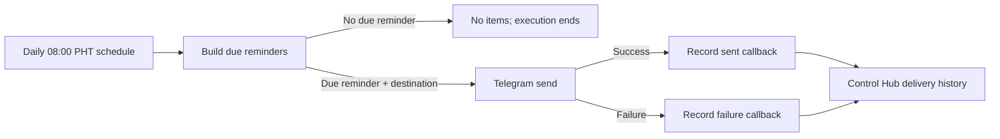

# Ultimate Health Project Optimization Record

## Relevant Code Map

- [Reminder schedule and history API](../../../apps/web/src/app/api/uhp/reminders/route.ts)
- [Authenticated n8n callback route](../../../apps/web/src/app/api/uhp/reminders/runs/route.ts)
- [Callback secret validation](../../../apps/web/src/app/api/uhp/_lib.ts)
- [Reminder workflow definition](../../../n8n/workflows/uhp-herbalife-portal-reminders.json)
- [Workflow regression tests](../../../n8n/workflows/uhp-workflows.test.ts)
- [Reminder-date calculation tests](../../../apps/web/src/lib/uhp-reminders.test.ts)

## Records

### Audited — 2026-10-02: Delivery readiness and observability

- Problem/evidence: The live reminder workflow was inactive, had no configured Telegram destinations, and had no executions. Its Code node correctly returns no items when no reminder is due, which can look like a failed workflow unless understood.
- Solution: Keep the empty-output behavior (it prevents off-schedule messages), document the expected schedule, and require the first delivery to be verified through both Telegram and Control Hub history before activation.
- Code paths: reminder workflow and callback API listed above.
- Validation/resume condition: Live inspection confirmed 08:00 PHT scheduling, Header Auth on both callbacks, a connected failure branch, and zero destinations/executions. Resume when a chat ID is configured; validate a sent or failed delivery record after a due-date test.

### Planned: Callback resilience

- Problem/evidence: A Telegram failure is recorded, but callback HTTP requests have no configured retry policy; a transient Control Hub outage could leave a send unrecorded.
- Proposed solution: Define and test an n8n retry/error-handling policy for the two callback nodes before increasing recipient volume.
- Code paths: [reminder workflow](../../../n8n/workflows/uhp-herbalife-portal-reminders.json).
- Validation/resume condition: Resume after the first successful production delivery establishes baseline behavior; verify retries do not create duplicate history records because `idempotency_key` is already used.

## Visual Guide

## Change Log

- 2026-10-02: Audited live workflow deployment state and documented the remaining recipient, activation, and first-delivery verification steps.
