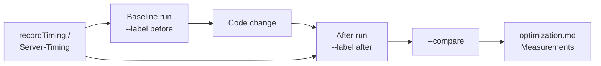

# Latency Measurement

Use this guide whenever a change can affect page load time, API response time, auth/session overhead, or database query cost. The agent workflow is in [`.github/skills/measure-latency/SKILL.md`](../../.github/skills/measure-latency/SKILL.md).

## Components

| Path | Role |
| --- | --- |
| [`scripts/performance/measure-latency.ts`](../../scripts/performance/measure-latency.ts) | Live sampler, log summarizer, and before/after comparison CLI (`pnpm performance:latency`). |
| [`scripts/performance/lib/latency-stats.ts`](../../scripts/performance/lib/latency-stats.ts) | Percentiles, `Server-Timing` parsing, structured log parsing, and Markdown tables. |
| [`apps/web/src/lib/observability/timing.ts`](../../apps/web/src/lib/observability/timing.ts) | Feature-agnostic `startTiming`, `recordTiming`, and `appendServerTiming`. |
| [`apps/web/src/lib/auth/timing.ts`](../../apps/web/src/lib/auth/timing.ts) | Auth wrapper that emits `[auth-timing]` events. |
| [`scripts/performance/serve-web-prod.mjs`](../../scripts/performance/serve-web-prod.mjs) | `pnpm performance:serve`: builds into `apps/web/.next-perf` and runs `next start` on port 3101, alongside `pnpm dev:web`. |
| [`scripts/accounts/ensure-latency-bench-account.mjs`](../../scripts/accounts/ensure-latency-bench-account.mjs) | Creates or rotates the dedicated benchmark account and writes `LATENCY_BENCH_*` to an env file. Dry-run by default. |

## Environment Setup

Both Supabase environments are measurable without passing credentials on the command line.

| Environment | Command | App URL | Credentials file |
| --- | --- | --- | --- |
| Local (`next dev`) | `pnpm performance:latency ...` | `http://localhost:3001` | `apps/web/.env.local`: local sample `admin@example.com` |
| Local (production build) | `pnpm performance:serve`, then `pnpm performance:latency --base-url http://localhost:3101 ...` | `http://localhost:3101` | `apps/web/.env.local` |
| Production | `pnpm performance:latency:prod ...` (explicit user request only) | `https://app.sngroup.com.au` | `apps/web/.env.local.prodops`: `latency-bench@example.com` (admin) |

All env files are gitignored. If an account is missing or its password changed, re-provision it:

```powershell
# Local: sample accounts (password "password"); re-run after `supabase db reset`
node scripts/accounts/setup-sample-accounts.mjs

# Production benchmark account: preview, then apply (rotates the password)
node scripts/accounts/ensure-latency-bench-account.mjs --env-file apps/web/.env.local.prodops
node scripts/accounts/ensure-latency-bench-account.mjs --env-file apps/web/.env.local.prodops --apply
```

`latency-bench@example.com` has role `admin` so it can reach admin dashboard APIs. It has no `employees` row, so it does not appear in directory or headcount data. Its password is random and exists only in `.env.local.prodops`.



## Live Sampling

```powershell
# Authentication preset: /dashboard, a middleware-protected API, and two middleware-bypassed APIs
pnpm performance:latency --preset auth --label before

# Any feature
pnpm performance:latency --feature directory --targets "/admin/directory,/api/notifications?limit=1" --label before

# Public routes without sign-in
pnpm performance:latency --feature www --anonymous --base-url http://localhost:3000 --targets "/" --label before
```

| Option | Default | Notes |
| --- | --- | --- |
| `--feature` | preset feature or `general` | Output folder under `perf-results/`. |
| `--targets` | preset targets | Comma-separated read-only GET paths. |
| `--preset` | none | `auth` is currently available. |
| `--samples` / `--warmup` | `30` / `3` | Targets are interleaved per iteration; warmups are discarded. |
| `--logins` | preset or `1` | Fresh password sign-ins timed as `Supabase password sign-in`. |
| `--base-url` | `LATENCY_BENCH_BASE_URL` or `http://localhost:3001` | |
| `--anonymous` | off | Skip sign-in. |
| `--allow-remote` | off | Required for any non-local app or Supabase URL. Use only when the user explicitly requests it. |
| `--out` | `perf-results/<feature>/<timestamp>-<label>.json` | `perf-results/` is gitignored. |

Credentials come from `LATENCY_BENCH_EMAIL`/`LATENCY_BENCH_PASSWORD` in the loaded env file (see [Environment Setup](#environment-setup)), falling back to `E2E_AUTH_EMAIL`/`E2E_AUTH_PASSWORD`. Shell variables override the file. Additional sign-ins are revoked with local-scope sign-out, and the measurement session is always signed out, even after an error. The script exits with code 1 if sign-in fails or a target redirects to `/login`. It warns when any target returns a non-2xx status.

Each target reports `total` (complete response), `ttfb` (headers received), and `st:<metric>` for every `Server-Timing` metric, such as `st:auth_middleware`.

## Phase Instrumentation

```ts
import { appendServerTiming, recordTiming, startTiming } from '@/lib/observability/timing';

const startedAt = startTiming();
const result = await loadDirectory(supabase);
const durationMs = recordTiming({
  scope: 'directory',
  layer: 'api-handler',
  operation: 'loadDirectory',
  route: '/api/directory',
  startedAt,
});
const response = NextResponse.json(result);
appendServerTiming(response.headers, 'directory_load', durationMs, 'Directory query');
```

Structured events are logged only when `LATENCY_TIMING_ENABLED=true` (auth events also honor `AUTH_TIMING_ENABLED=true`). Use route templates and operation names only; never log user IDs, emails, query values, or record IDs.

To summarize server events, capture the server output and pass it to the CLI:

```powershell
$env:LATENCY_TIMING_ENABLED = 'true'; pnpm dev:web *>&1 | Tee-Object -FilePath perf-results\server.log
pnpm performance:latency --log perf-results\server.log
```

## Comparison and Recording

```powershell
pnpm performance:latency --compare perf-results\authentication\<before>.json perf-results\authentication\<after>.json
```

Paste the resulting table into the feature's `optimization.md` under a `Measurements` heading, along with:

- date, before/after commits, and whether either worktree was dirty;
- environment: `next dev` or `next start`, local Supabase, and machine;
- user role, targets, samples, warmups, and status-code anomalies;
- interpretation, including whether deltas exceed the control route's noise.

## Production Measurement

Run production measurements only when the user explicitly requests them. The sampler sends read-only GETs, but each authenticated run performs real password sign-ins that appear in Supabase Auth logs.

```powershell
pnpm performance:latency:prod --preset auth --label prod-baseline
```

- `performance:latency:prod` loads `apps/web/.env.local.prodops` (production Supabase URL, anon key, and the `latency-bench@example.com` credentials), targets `https://app.sngroup.com.au`, and passes `--allow-remote`. Shell variables take precedence over the env file.
- Use only the dedicated benchmark account; never use a real employee's credentials.
- Never include routes with side effects. For example, `/api/calendar/events` syncs calendar rows and sends notifications on each call.
- Production totals include network round trips from the measuring machine to the Vercel edge. Record the location, and compare only runs taken from the same place.
- The `x-vercel-id` response header shows the edge and function regions (for example, `sin1::iad1` means a Singapore edge with US East execution). Record it with the run.
- For server-side phase numbers, set `LATENCY_TIMING_ENABLED=true` (or `AUTH_TIMING_ENABLED=true`) in Vercel, redeploy, then export the function logs and summarize them with `pnpm performance:latency --log <file>`. Remove the flag afterward.

## Measuring an Already-Merged Change

```powershell
git worktree add ..\sn-baseline <commit-before-change>
# Install, copy apps/web/.env.local, and start that worktree on another port, e.g. 3011.
pnpm performance:latency --preset auth --base-url http://localhost:3011 --label before
```

Keep the server mode the same for both runs. Remove the worktree afterward with `git worktree remove ..\sn-baseline`.
