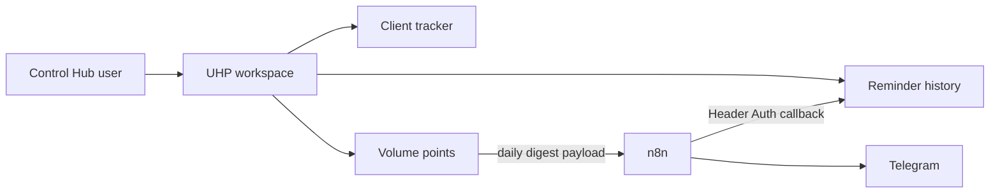

# Ultimate Health Project workspace

The UHP workspace makes Control Hub the system of record for the client tracker, Herbalife portal reminder history, and volume points.

## Access

Admins and super admins can access all modules. Other users need an active row in `uhp_access_grants` for each module: `client_tracker`, `portal_reminders`, or `volume_points`.

## Routes

- `/uhp/clients`: client records and current-month communication metrics.
- `/uhp/reminders`: upcoming Herbalife reminders and n8n delivery history.
- `/uhp/volume-points`: monthly VP entries, targets, forecasts, and totals.

## Deployment

1. Apply `20260923000002_create_uhp_workspace.sql`.
2. Set a strong `N8N_CALLBACK_SECRET` in the Control Hub production environment.
3. In n8n, create or reuse the Header Auth credential named **Control Hub Callback**. Its header name must be `x-control-hub-n8n-secret` and its value must exactly match Control Hub's `N8N_CALLBACK_SECRET`.
4. Import the two `n8n/workflows/uhp-*.json` files. The production Control Hub URL (`https://app.sngroup.com.au`) is already stored in each workflow, so n8n environment-variable access is not required.
5. Select **Control Hub Callback** on every Control Hub HTTP Request node. The checked-in workflow uses `REPLACE_WITH_CONTROL_HUB_CALLBACK_CREDENTIAL_ID` because credential IDs are instance-specific.
6. In each workflow, edit **Configure Telegram Destinations**. Replace `[]` with JSON such as `[{"key":"steven","chatId":"123456789"}]`.
7. Attach the existing Telegram credential to the send node, execute manually, verify both a successful and failed run in Control Hub, then activate.

Both workflow files are inactive by design. The portal workflow checks daily at 08:00 PHT and emits only applicable reminders. The VP workflow sends every day at 12:00 PHT, including an explicit no-change message. Telegram send failures are recorded through the same callback APIs with a `failed` status and error detail.

For source data, prepare one JSON export with optional `clients`, `activities`, `notes`, `volumePoints`, and `targets` arrays. Every client, activity, and note requires a stable `notion_page_id`; activities and notes also require `client_notion_page_id`. Every volume-point row requires `source_sheet` and `source_row`. Preview it with `node scripts/backfill/import-uhp-workspace.mjs export.json`; add `--apply` only after reviewing the counts. The importer writes clients first, resolves their database IDs for related activities and notes, and uses stable source keys for repeatable upserts.

## Source migration rules

Only Notion clients typed as Retail, Recruitment, or Accountability Partner belong in UHP. Property Development and 40 Carlingford records are excluded. Untyped records should be imported with `migration_review_required = true` and kept out of operational metrics until reviewed. Preserve source IDs in `notion_page_id` or the `source_sheet`/`source_row` pair so imports are repeatable.
